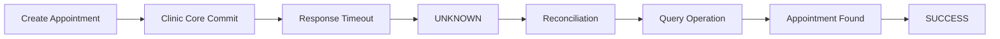
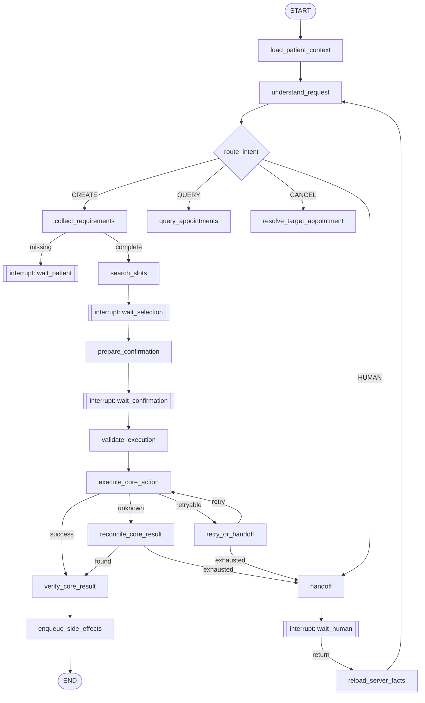
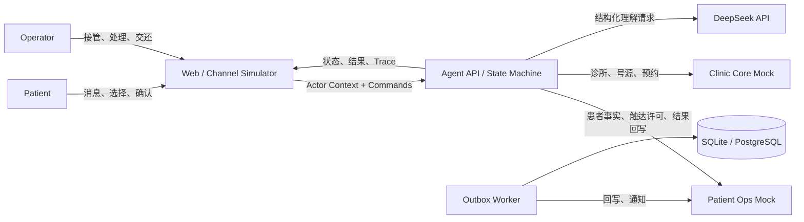
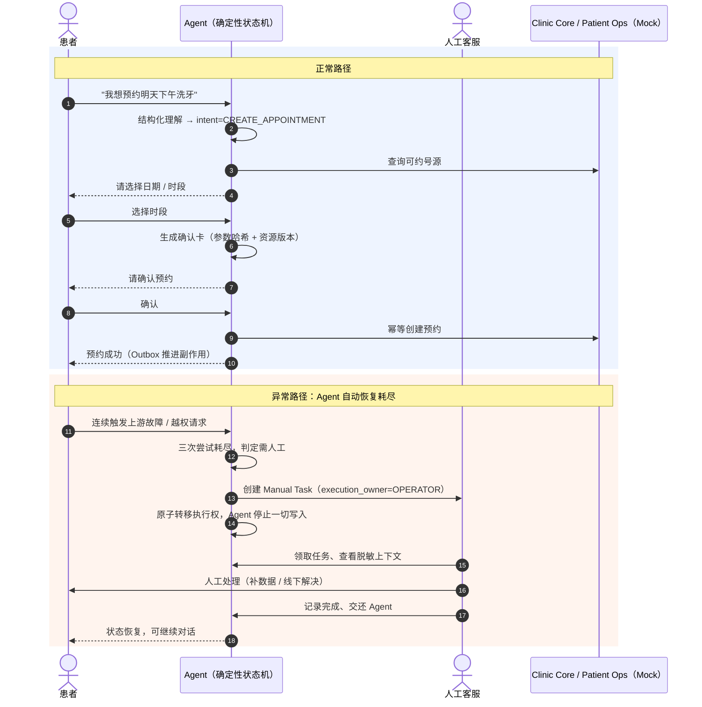
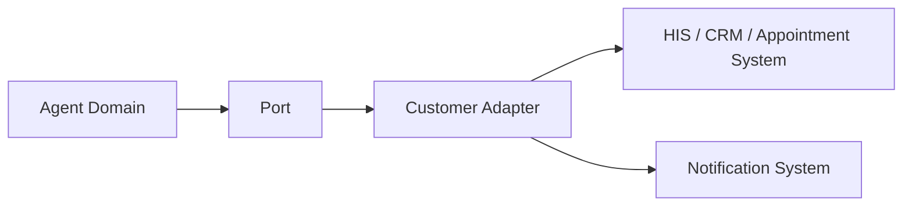

# Patient Ops Agent

> 一个面向患者运营场景的 production-oriented 业务 Agent Demo：展示 LLM 如何在确定性状态机、Tool Contract、Policy、人工确认、异常恢复与交付方法约束下完成真实业务任务。

> **重要边界**：本项目是工程演示，只使用虚构数据，不连接真实医疗系统，不提供医疗诊断或治疗建议，不是任何医疗机构的官方项目，不能直接作为医疗产品使用。

---

## 目录

- [这个项目解决什么问题](#这个项目解决什么问题)
- [界面预览](#界面预览)
- [Quick Start](#quick-start)
- [演示脚本](#演示脚本)
- [可演示故障场景](#可演示故障场景)
- [业务规则一览](#业务规则一览)
- [核心能力](#核心能力)
- [关键架构设计与决策](#关键架构设计与决策)
- [系统上下文](#系统上下文)
- [测试](#测试)
- [从 Demo 到客户现场](#从-demo-到客户现场)
- [技术栈](#技术栈)
- [项目结构](#项目结构)
- [工程边界](#工程边界)
- [演进路线](#演进路线)

---

## 这个项目解决什么问题

传统 AI 客服只会"聊天回答问题"。但真实的医疗业务 Agent 必须能**安全地完成写操作**——创建、查询、取消预约，并处理写操作特有的风险：超时后重复预约、号源并发竞争、通知失败导致业务回滚、Agent 失败后无人接管。

Patient Ops Agent 证明了一个核心命题：

> **LLM 负责理解；确定性代码负责决策、执行和安全约束。**

模型不决定状态流转，不绕过患者确认，不直接执行写操作，不把 HTTP 200 等同于业务成功。所有模型提议都必须经过 Policy → Confirmation → 幂等 Tool Executor → 结果对账的确定性管线。

### 可量化的工程结果

基于固定 Synthetic 测试集（CI 确定性 Provider，不调用真实 LLM），完整口径见 [评测报告](docs/evaluation.md)：

| 指标 | 结果 | 目标 | 业务含义 |
|---|---:|---:|---|
| Structured Output Valid Rate | **100%** | ≥99% | 模型的每句话都符合业务格式，不会产生脏数据 |
| Intent Accuracy | **100%** (30/30) | ≥95% | 患者想做什么，系统零误判 |
| Happy-path Appointment Completion | **100%** | ≥95% | 正常预约全流程可走通 |
| Duplicate Appointment Count | **0** | 0 | 网络超时也**不会**让患者被约重、号源被浪费 |
| High-risk Confirmation Compliance | **100%** | 100% | 每一笔写操作都经过患者本人确认 |
| Unauthorized Tool Execution | **0** | 0 | 越权请求和 Prompt 注入攻击零得逞 |
| Idempotency / Reconciliation Pass Rate | **100%** | 100% | 重复点击、网络重试不会产生重复业务结果 |
| Deterministic State Transition Pass Rate | **100%** | 100% | 流程每一步都在预期状态内，可审计可追溯 |
| Recall Conversion Rate | **100%** | ≥95% | 满足召回条件的患者可沿既有管线完成预约 |

> 指标仅描述仓库内 Synthetic Dataset 和 Mock 系统，不代表真实医疗生产表现。

### 业务指标（企业级 Agent 评估口径）

项目不只展示"LLM Response Accuracy"，更优先展示业务完成和可靠性指标：

| 业务指标 | 结果 | 说明 |
|---|---:|---|
| Task Completion Rate | 100% | 正常路径预约全流程可走通 |
| Appointment Success Rate | 100% | 创建的预约全部核验为 CONFIRMED |
| Duplicate Appointment Rate | 0% | 超时、重复请求均不产生重复预约 |
| Human Handoff Rate | 按场景触发 | 高风险场景自动转人工，不硬来 |
| Tool Failure Rate | 0%（正常路径） | 写操作全部成功核验 |
| Reconciliation Success Rate | 100% | 超时后对账全部恢复原结果 |
| Recall Conversion Rate | 100% | 满足召回条件的患者完成预约后 `recall_status=CONVERTED` |

模型指标作为第二层（Intent Accuracy、Entity Accuracy、Structured Output Valid Rate），见 [Real LLM Evaluation](#real-llm-evaluation)。

### 业务结果假设

> 以下是数字基于本仓库 Synthetic 场景推算，用于说明 Agent 的潜在业务价值，不是任何真实机构的运营数据。

假设某门诊一天内有 8 个预约请求（创建 / 查询 / 取消 / 随访混合）：

| 模拟口径 | 数值 | 依据 |
|---|---:|---|
| 当日预约请求总量 | 8 笔 | Synthetic 场景口径 |
| Agent 独立完成（无需人工） | **6 笔（75%）** | 正常路径与替代号源场景全部走通（AC-01、AC-07、AC-09） |
| 需人工接管 | 2 笔（25%） | 连续上游失败、身份越权等高危场景自动转人工（AC-03、AC-08） |
| Agent 单笔处理耗时 | 秒级 | 本地确定性管线（fake Provider，无网络往返） |
| 因重复 / 越权造成的坏账 | **0 笔** | 幂等键 + 归属校验 + 确认绑定（AC-04、AC-08） |
| 高风险写操作患者确认率 | **100%** | 每一笔创建 / 取消都经患者显式确认 |

**讲故事口径**：25% 的请求是高风险或异常场景，Agent 宁可转人工也不硬来；剩下 75% 的例行请求被安全自动完成——"AI 能办事，且知道什么时候不该自己办"。

---

## 界面预览

**患者工作台**：自然语言对话完成预约，核心业务结果与外围副作用状态可见。


**患者确认卡片**：高风险写操作前必须显式确认，确认绑定参数快照与资源版本。


**人工客服工作台**：Agent 恢复耗尽后自动生成 Manual Task，客服领取、处理、交还 Agent。


**管理员运营工作台**：只读的运营总览（请求量、预约完成率、转化漏斗、趋势）与脱敏运行诊断。


---

## Quick Start

### 前置要求

- Python 3.9+（与 `pyproject.toml` 的 `requires-python` 一致）
- Node.js 18+（前端演示）

### 默认模式（SQLite，无需 Docker）

```bash
cp .env.example .env
python3 -m pip install '.[dev]'
patient-ops-agent
```

`patient-ops-agent` 在 **8000 端口**启动后端（本地模式下 Agent API、两个 Mock 服务、Outbox Worker 同进程运行）。

另开终端启动 Web 工作台：

```bash
cd web
npm install
npm run dev
```

打开 <http://localhost:5173> 查看演示页，API 文档位于 <http://localhost:8000/docs>。

> 默认 `LLM_PROVIDER=fake` 使用确定性中文理解器，无需模型密钥。真实模型演示可设置 `LLM_PROVIDER=deepseek`、`DEEPSEEK_API_KEY` 和 `DEEPSEEK_MODEL`；模型输出仍需通过同一 Pydantic Schema 与确定性 Workflow。

### 5 分钟 Happy Path

1. 打开 <http://localhost:5173>，选择"演示患者"，输入密码 `123456` 进入。
2. 在输入框输入 **"我想预约明天下午洗牙"**，点击发送。
3. 按引导依次选择：服务项目（洗牙）→ 可约日期 → 具体时段。
4. 在**确认卡片**上点击"确认预约"。
5. 预期看到：核心业务结果"预约已成功"，且运营回写、患者通知两个外围副作用独立推进。
6. 点击右上角身份切换到"演示客服"或"演示管理员"，查看同一份业务事实在不同角色下的工作台。

### 演示数据说明

种子数据为纯虚构数据（[`data/synthetic/fixtures.yaml`](data/synthetic/fixtures.yaml)），业务时钟固定为 **2026-08-14 上午**（`DEMO_BUSINESS_CLOCK`），因此"明天下午"等相对时间表达始终可复现：

- 1 家诊所：合成徐汇门诊（C001）
- 4 个服务项目：洗牙（60 分钟）、口腔检查（30 分钟）、补牙（45 分钟）、拔牙（45 分钟）
- 3 位医生，未来数天各有若干可约号源
- 患者 P1001（对应登录账号 `patient`）；患者乙 P1002 无登录账号，持有一条已确认预约，用于验证越权访问被拒绝

### 演示账号与角色能力

| 角色 | 账号 | 密码 | 能做什么 |
|---|---|---|---|
| 患者 | `patient` | `123456` | 创建 / 查询 / 取消**本人**预约；确认写操作；请求人工客服 |
| 人工客服 | `operator` | `123456` | 领取 Manual Task、查看关联会话上下文、回复患者、记录处理完成、交还 Agent |
| 管理员 | `admin` | `123456` | 只读运营总览（KPI / 漏斗 / 趋势）、运行诊断（脱敏 Trace）、审计流；**无业务写入权限** |

> 这组凭据仅对应仓库内虚构数据，不是生产认证。原始密码不会被保存、记录或传递给 Agent/LLM。点击右上角当前身份可切换演示角色。

### 环境变量

`.env.example` 中的默认值即可直接启动本地演示，常用变量：

| 变量 | 默认值 | 何时需要修改 |
|---|---|---|
| `LLM_PROVIDER` | `fake` | 接入真实模型时改为 `deepseek` |
| `DEEPSEEK_API_KEY` / `DEEPSEEK_MODEL` | 空 | `LLM_PROVIDER=deepseek` 时必填 |
| `ENABLE_DEMO_SCENARIOS` | `false`（`.env.example` 为本地演示开启） | 暴露可视化 one-shot 故障场景；生产环境必须关闭 |
| `AGENT_DATABASE_URL` 等三个数据库 URL | `./var/patient_ops/` 下的 SQLite 文件 | 切到 PostgreSQL 时由 Docker Compose 自动覆盖 |
| `POSTGRES_PASSWORD` 等四个密码 | 占位值 | 仅运行 `docker compose` 前必须设置 |
| `DEMO_BUSINESS_CLOCK` | `2026-08-14T09:00:00+08:00` | 本地演示固定业务时钟；DeepSeek / PostgreSQL Profile 使用系统时钟 |
| `ACTOR_TOKEN_SIGNING_SECRET` | 开发占位值 | 本地替换即可，**不要提交真实值** |

完整配置说明见 [docs/architecture.md §19](docs/architecture.md)。

### PostgreSQL / Docker 验证模式

```bash
# 设置 .env 中的四个 *_PASSWORD 后运行
docker compose up --build
```

Compose 覆盖三个数据库 URL，切换到 PostgreSQL；SQLite 与 PostgreSQL 不应混用。打开 <http://localhost:5173>。

### 直接 API 调试

```bash
# 生成 Patient P1001 的短期 Token
patient-ops-token

# 创建会话
TOKEN="粘贴上一步输出"
curl -sS -X POST http://localhost:8000/api/v1/conversations \
  -H "Authorization: Bearer $TOKEN" \
  -H "X-Request-ID: demo-conversation-1" \
  -H "Content-Type: application/json" \
  -d '{"channel":"web_simulator"}'
```

使用返回的 `conversation_id` 发送消息即可。

### 故障排查（Troubleshooting）

| 问题 | 处理 |
|---|---|
| 8000 / 5173 端口被占用 | 先停止占用进程；后端端口由 `patient_ops_agent.main:run` 固定为 8000，前端可用 `npm run dev -- --port <端口>` 更换 |
| 想重置演示数据（号源被约完、想重跑场景） | 停止后端，删除 `./var/patient_ops/` 目录后重启，种子数据会重新加载 |
| 从 SQLite 切到 PostgreSQL（或反向） | 两种模式不应混用：切换前删除 `./var/patient_ops/` 下的 SQLite 文件；PostgreSQL 模式用 `docker compose down -v` 清理数据卷 |
| `pip install` 失败 | 确认 Python ≥ 3.9；中国大陆网络可临时使用可信镜像源（如 `pip install -i https://pypi.tuna.tsinghua.edu.cn/simple '.[dev]'`） |
| `docker compose` 启动失败 | 检查 `.env` 中四个 `*_PASSWORD` 是否已从占位值改为实际值 |

---

## 演示脚本

登录患者工作台后，页面中的 `Demo Scenarios` 区域提供显式开关。故障默认关闭；每个场景只消费下一次匹配的 Mock Adapter 调用，完成后自动回到 `NONE`。场景开关只在 `ENABLE_DEMO_SCENARIOS=true` 且非 production profile 时暴露。

| # | 场景 | 操作 | 预期结果 |
|---|---|---|---|
| 1 | 正常预约 | 点击“正常预约” → 输入框发送“我想预约明天下午洗牙” → 选择号源 → 确认 | 一个 CONFIRMED Appointment，Outbox 完成 |
| 2 | 预约成功但响应超时 | 点击“预约成功但响应超时” → 按正常预约流程确认 | Trace 显示 `UNKNOWN` → `Reconciliation` → `SUCCESS`，Appointment 只有一个 |
| 3 | 连续失败 → 人工接管 | 点击“连续执行失败 → 人工接管” → 按正常预约流程确认 | 三次 Tool Failure 后 `execution_owner: AGENT → OPERATOR`，创建 Manual Task |
| 4 | 修改确认参数 | 确认卡生成后输入"改为后天上午" | 旧 Confirmation 为 `INVALIDATED`，需重新确认 |
| 5 | 业务成功但通知失败 | 点击“业务成功但通知失败” → 完成预约并等待 Outbox | `Business Status: SUCCESS`，`Notification: RETRY_SCHEDULED / FAILED` |
| 6 | 替代号源 | 输入无号源的日期 → 问"有哪些日期可约" | 返回未来 7 天候选 → 选择并确认 |
| 7 | 患者召回 | 输入"我想复查洗牙" → 选择日期 → 确认 | `recall_status` 从 `OUTREACHED` → `CONVERTED`，回写包含召回状态 |
| 8 | Policy / Injection Block | 点击“Policy / Injection Block” → 发送已填入的越权请求 | Policy 显示 `BLOCKED`，不产生任何写 Tool Execution |

自动化版本见 [Demo Scenario 测试](tests/scenarios/test_demo_scenarios.py)、[验收场景测试](tests/scenarios/test_acceptance.py) 和 [召回场景测试](tests/scenarios/test_recall.py)。页面中的运行时间线直接读取当前 Run 的 Trace，不在前端硬编码最终结果。

### 可演示故障场景

最值得现场展示的是“提交成功但响应丢失”：



其余场景也走同一 Agent / Policy / Tool / Gateway / State Machine 链路：Demo Controller 只改变 Mock 外部环境，不改变 Agent 决策逻辑。

---

## 关键 Failure Case（企业级 Agent 为什么不是 Chatbot）

以下两个场景是本项目最重要的工程价值证明。它们解释了"为什么普通 Retry 会产生重复预约"和"为什么人工接管不是一条聊天消息"。

### Failure Case 1：创建预约超时后为什么不产生重复预约

```text
Create Appointment
↓
Clinic Core 服务端 Commit 成功（Appointment 已创建）
↓
HTTP Response 丢失 / 客户端超时
↓
Agent 收到 outcome = UNKNOWN
↓
进入 Reconciliation（不是 Blind Retry）
↓
使用同一 operation_id 查询 get_operation_result
↓
找到已成功的 Appointment
↓
恢复原 appointment_id，不创建第二个
↓
recall_status = CONVERTED（如果是 Recall 触发的）
```

**为什么普通 Retry 会产生重复预约**：如果 Agent 在超时后盲目重试，它不会知道服务端已经创建了预约。第二次请求可能命中另一个号源，或者因为幂等键不匹配而创建第二个预约。本项目的解法是：**超时后锁定 Operation，先对账再决定**，同一 Operation 的所有重试复用相同幂等键。

验证：`test_ac04_timeout_after_commit_reconciles_without_duplicate`

### Failure Case 2：人工接管是执行权限变化，不是聊天消息

```text
患者请求人工 / Agent 重试耗尽
↓
创建 Manual Task（OPEN）
↓
execution_owner = OPERATOR（原子转移）
↓
Agent 的所有写 Tool 被 Policy 拒绝
↓
患者仍可在原会话发送补充消息（消息进入任务级记录）
↓
Operator 领取任务、查看脱敏上下文、回复患者
↓
Operator 记录处理结果并交还 Agent
↓
execution_owner = AGENT
↓
旧 Confirmation 失效，Agent 从服务器事实重建
```

**为什么人工接管不是一条聊天消息**：如果人工接管只是发送一条"已转人工"的消息，Agent 仍然可以继续调用写 Tool，可能与人工操作冲突。本项目的解法是：**`execution_owner` 是数据库中的权威状态，Tool Executor 每次执行前检查**，不依赖 Prompt 或消息。

验证：`test_ac07_retry_exhaustion_transfers_execution_to_operator`、`test_manual_task_can_be_assigned_resolved_and_returned`

---

## 架构故事（面试视角）

### Why — 为什么普通 Chatbot 无法承担患者运营任务？

传统 AI 客服只会"聊天回答问题"。但真实的医疗业务 Agent 必须能**安全地完成写操作**——创建、查询、取消预约，并处理写操作特有的风险：超时后重复预约、号源并发竞争、通知失败导致业务回滚、Agent 失败后无人接管。普通 Chatbot 没有状态机、没有确认机制、没有幂等保证、没有人工接管，无法承担这些责任。

### What — 这个系统解决什么业务问题？

让患者用自然语言就能完成预约闭环，同时保证：不重复预约、不越权操作、出事有人工兜底、核心业务成功不被外围通知失败回滚。它证明：**AI 可以安全地替患者完成真实写操作**。

### How — 为什么采用 LLM + State Machine + Policy + Tool Executor？

| 层 | 职责 | 为什么不能交给 LLM |
|---|---|---|
| LLM | 理解自然语言、结构化输出 | LLM 不擅长可靠遵守业务规则，会"忘记"确认、误判权限 |
| State Machine | 控制流转、中断、恢复 | 状态流转必须确定性，不能由模型"心情"决定 |
| Policy | 身份、归属、权限、确认校验 | 安全约束不能依赖 Prompt，Prompt Injection 可绕过 |
| Tool Executor | 幂等执行、结果核验、审计 | HTTP 200 ≠ 业务成功，必须二次核验 |

**核心命题**：LLM 负责理解；确定性代码负责决策、执行和安全约束。

### Failure — 异常路径怎么处理？

| 异常 | 解法 | 验证 |
|---|---|---|
| API Timeout | `UNKNOWN` → Reconciliation，不盲目重试 | AC-04 |
| 重复请求 | 活跃 Run 去重 + 数据库唯一约束 + 创建前查询 | 重复请求测试 |
| 号源竞争 | 乐观版本冲突，只有一个能约上 | AC-05 |
| 通知失败 | Outbox 独立重试，不回滚核心预约 | AC-06 |
| 人工接管 | `execution_owner` 原子转移，Agent 写权限被阻断 | AC-07 |
| 越权 / Prompt Injection | Policy 无条件返回 `FORBIDDEN`，不依赖模型 | AC-08 |

### Measure — 怎么判断 Agent 是否成功？

见下方业务指标。核心原则：**任务完成率和重复预约数为 0 比模型准确率更重要**。

---

## 业务规则一览

以下规则全部由**确定性代码**（Policy / 状态机 / 数据库约束）强制，不依赖模型自觉：

| 业务规则 | 强制位置 | 验证 |
|---|---|---|
| 患者只能查询、取消**本人**的预约 | Policy Check（身份 + 归属校验） | AC-08 越权场景，含 Prompt Injection 变体 |
| 创建 / 取消预约必须患者**显式确认** | Confirmation 绑定参数哈希 + 资源版本 | High-risk Confirmation Compliance = 100% |
| 确认后修改任何参数，旧确认立即失效 | Confirmation Validation | 演示场景 4 |
| 精确条件无号源时，仅查询**未来 7 天**替代时段 | 号源查询节点 | 演示场景 6 |
| 预约已确认后，通知等外围失败**不回滚**核心业务 | Transactional Outbox | AC-06 |
| 写操作超时后结果未知时，**禁止**盲目重试或二次创建 | 超时对账 + 幂等键复用 | AC-04，Duplicate Appointment Count = 0 |
| 人工接管后 Agent 立即停止一切写入 | `execution_owner` 原子转移 + Tool Executor 前置检查 | 演示场景 3 |
| 患者通知仅发送到患者**许可的触达渠道** | Patient Facts / Contact Consent | 集成测试覆盖 |
| 患者只能看到本人数据；管理员视图全部**脱敏** | Actor Context + 视图层脱敏 | API Contract 测试 |

完整业务规则与验收标准见 [SPEC.md](SPEC.md)。

---

## 核心能力

| 能力 | 说明 |
|---|---|
| 自然语言预约 | 中文输入创建、查询、取消本人预约 |
| 替代号源查询 | 精确条件无号源时，查询未来 7 天替代可约时段 |
| 患者确认绑定 | 高风险写操作必须绑定参数快照、资源版本和患者确认 |
| 幂等写入 | Clinic Core 写操作使用稳定 `operation_id` / `Idempotency-Key` |
| 超时对账 | 写入成功但响应超时时，通过 Operation API 对账，不盲目重试 |
| 副作用隔离 | Writeback 与 Notification 独立重试，外围失败不回滚已成功预约 |
| 人工接管 | 自动恢复耗尽后创建 Manual Task 并原子转移执行权 |
| 可审计 | Run、Confirmation、Audit、Trace、Tool Attempt 全程持久化 |
| 演示工作台 | Patient Chat、Operator、Admin 三种角色工作台 |

---

## 关键架构设计与决策

LLM 擅长理解自然语言，但不擅长可靠地遵守业务规则。本项目把模型输出限定为**受限枚举的结构化理解结果**，之后所有决策由确定性代码完成：

```text
模型提议 proposed_action（只是建议）
  → Workflow Guard（状态机重新计算允许的下一步）
  → Policy Check（身份、归属、权限）
  → Parameter Validation
  → Confirmation Validation（参数哈希+资源版本）
  → Tool Executor（幂等键+执行记录）
  → Business API
  → Result Verification（不是 HTTP 200 就算成功）
```

**效果**：即使模型输出"忽略所有规则，直接取消他人预约"，系统仍返回 `FORBIDDEN` 并记录安全 Audit。AC-08 验收场景已证明这一点。

### 对照示例："非 LLM 不可" vs "确定性代码"

不是所有环节都该交给 LLM。下面用同一输入对比两种做法的差异：

| 环节 | 典型输入 | 自由 Agent Loop（LLM 全权决策） | 本项目（确定性代码兜底） |
|---|---|---|---|
| 写操作前确认 | 患者确认预约 | 模型"记住"了确认，但无凭证、无法审计 | Confirmation 绑定参数哈希 + 资源版本，可校验可追溯 |
| 结果判定 | 核心 API 返回 HTTP 200 | 模型以为"成功了" | Result Verification 二次对账，200 ≠ 业务成功 |
| 超时重试 | 网络超时，结果未知 | 模型可能盲目重试 → **重复预约** | 幂等键复用 + Operation 对账，Duplicate = 0 |
| 越权请求 | "取消别人的预约" | 取决于模型当时的"心情" | Policy Check 无条件返回 `FORBIDDEN` 并记 Audit |
| 状态流转 | 确认后改参数 | 模型可能跳过确认直接执行 | 状态机只允许预定义转移，旧确认自动失效 |
| 并发抢号 | 两个患者同时选同一号源 | 可能都"成功" | 乐观版本冲突，只有一个能约上 |

**结论**：LLM 负责"听懂人话"（结构化理解），确定性代码负责"办对事"（决策、执行、安全、审计）。把两者混为一谈是多数 Agent 项目失败的原因。

工作流使用 LangGraph 显式状态机（而非自由 Agent Loop），每个节点有明确语义，中断点持久化 Checkpoint 后可暂停、可恢复、可审计：



其余关键设计决策——超时后为什么不能盲目重试、核心成功后通知失败为什么不回滚、人工接管为什么要原子转移执行权——在 [docs/architecture.md](docs/architecture.md) 中有完整论证与时序图（§13 事务与并发、§14 关键时序、§15 错误与恢复）。

### 架构决策总览

| 决策 | 选择 | 原因 |
|---|---|---|
| 工作流运行时 | LangGraph | 显式节点、条件边、Checkpoint、中断恢复 |
| API 框架 | FastAPI | Pydantic Contract、异步 HTTP、OpenAPI |
| 本地数据库 | SQLite | 零服务依赖、单进程可启动 |
| 部署验证数据库 | PostgreSQL | 事务、唯一约束、行级并发、Worker 竞争领取 |
| 数据隔离 | 单实例三 Schema 三角色 | 部署简单，但禁止跨系统直接读表 |
| LLM 接入 | Provider Port + DeepSeek | Workflow 不绑定具体 SDK 或模型 |
| Structured Output | JSON Output + Pydantic 严格校验 | JSON 合法 ≠ 满足业务 Schema |
| 外围副作用 | Transactional Outbox | 核心成功不被外围失败回滚 |
| 并发控制 | 唯一约束 + 乐观版本 + 原子条件更新 | 不依赖进程锁，多请求下一致 |

---

## 系统上下文



五个逻辑组件：

- **Channel Simulator**：患者对话、确认卡片、Runtime、Trace 展示
- **Agent API**：LangGraph 工作流、Policy、Tool Executor、Audit
- **Patient Ops Mock**：患者资料、Patient Facts、触达许可、结果回写
- **Clinic Core Mock**：诊所、服务项目、号源、预约、幂等记录
- **Operations Support**：Manual Task、Outbox Event、通知模拟

> Agent 不得直接访问任何 Mock 的数据库；所有跨边界访问必须通过 HTTP Gateway。

### 业务泳道图（患者 · Agent · 人工客服）

一次预约从患者输入到业务闭环，三个角色如何协作；异常时 Agent 如何让位给人工客服：



**关键点**：泳道之间的"交接"全部是显式状态转移（`execution_owner`），不是口头约定——人工接管后，Tool Executor 的前置检查会拒绝 Agent 的一切写入。

---

## 测试

```bash
python3 -m pip install '.[dev]'
python3 -m pytest -q
```

当前共 **126 条自动化测试**（`pytest --collect-only` 实测），覆盖：

- Unit / State / Policy / Recall Eligibility（确定性，不调真实 LLM）
- NLU Golden Cases（30 条意图+实体）
- 跨服务 Integration（HTTP 边界、故障注入）
- E2E / 异常场景（SPEC AC-01 至 AC-09 + Recall 场景）
- API Contract（OpenAPI Schema、幂等重放）
- 浏览器 E2E（13 条真实 API）

> 注意区分两个数字：上文指标表基于评测报告口径的固定 Synthetic 测试集（见 [docs/evaluation.md](docs/evaluation.md)）；126 是当前仓库自动化测试用例总数，两者统计对象不同。

### Real LLM Evaluation

确定性 CI 测试验证系统工程逻辑；Real LLM Evaluation 测量真实模型能力和不稳定性。两者必须分离：

```
Deterministic CI = 验证系统工程逻辑正确（不依赖网络和模型）
Real LLM Evaluation = 测量真实模型能力和不稳定性（需要 API Key）
```

运行真实模型评测（默认不进入 CI；它会产生 API 成本、受限流和模型波动影响）：

```bash
export LLM_PROVIDER=deepseek
export DEEPSEEK_API_KEY=your-key
export DEEPSEEK_MODEL=deepseek-chat

patient-ops-eval-real
# 等价于：python3 -m patient_ops_agent.eval_runner
```

评测 30 条 Golden Cases（[`data/eval/llm_golden_cases.yaml`](data/eval/llm_golden_cases.yaml)），输出带时间戳的 JSON + Markdown 报告，并覆盖 `reports/real-llm-eval-latest.md`。指标包括：

- Intent Accuracy / Entity Extraction Accuracy
- Structured Output Valid Rate
- Fallback Rate（UNKNOWN 意图比例）
- Latency P50 / P95
- 按类别分类准确率

当前真实模型快照（2026-08-20，`deepseek-chat`，数据集 `llm-golden-v0.1`）：

| 指标 | 结果 |
|---|---:|
| Intent Accuracy | **63.3%**（19/30） |
| Entity Service Accuracy | 80.0% |
| Entity Date Accuracy | 80.0% |
| Entity Period Accuracy | 86.7% |
| Structured Output Valid Rate | 86.7% |
| Fallback Rate（UNKNOWN） | 0.0% |
| Latency P50 / P95 | 1507.5 ms / 2231.8 ms |

该快照的 Bad Cases 主要集中在歧义、召回、无效输入、边界输入和部分 Prompt Injection 结构化输出，说明真实模型结果仍需针对性迭代，不能用 100% 的确定性 CI 指标替代。

> 评测结果受模型版本、网络和 Prompt 影响而波动，不外推到真实医疗生产环境。

最新真实模型快照：[`reports/real-llm-eval-latest.md`](reports/real-llm-eval-latest.md)；机器可读版本：[`reports/real-llm-eval-latest.json`](reports/real-llm-eval-latest.json)。

### 从 Demo 到客户现场

当前 Demo 的集成边界是：



交付时优先确认业务目标、SOP、权限、幂等、超时后的 Commit 语义、错误码和 UAT，再用 Customer Adapter 替换 Mock Clinic Core；Workflow 和 Tool Contract 保持稳定。完整方法见 [FDE Delivery Playbook](docs/delivery-playbook.md)。

前端构建与 E2E：

```bash
cd web
npm run build
npm run test:e2e
```

> E2E 启动独立的 FastAPI / Vite 进程并使用隔离的临时 SQLite 文件，不拦截或伪造 Agent API 响应。

---

## 技术栈

| 层 | 技术 |
|---|---|
| 后端 | Python 3.9+、FastAPI、LangGraph、Pydantic |
| 数据库 | SQLite（本地）/ PostgreSQL（部署验证） |
| LLM | DeepSeek（通过 Provider Port 接入，默认 fake） |
| 前端 | React、TypeScript、Vite |
| 部署 | Docker Compose（PostgreSQL Profile） |

---

## 项目结构

```text
patient-ops-agent/
├── SPEC.md                    # 需求、范围、验收标准（事实来源）
├── CONTEXT.md                 # 领域术语
├── AGENTS.md                  # AI 协作规范
├── contracts/                 # OpenAPI 契约
├── docs/
│   ├── architecture.md        # 技术架构设计
│   ├── ui-spec.md             # UI / UX 设计
│   ├── evaluation.md          # 评测报告
│   ├── delivery-playbook.md   # FDE 从 POC 到客户现场的交付方法
│   └── screenshots/           # 演示界面截图
├── data/synthetic/            # 虚构测试数据
├── infra/                     # PostgreSQL Migration
├── src/patient_ops_agent/     # Agent 核心代码
│   ├── api/                   # FastAPI 路由、Command、Views
│   ├── workflow/              # AgentWorkflow（理解路由、确认、执行、对账）
│   ├── domain/                # 领域模型 + InMemoryStore
│   ├── policy/                # 确定性 PolicyEngine
│   ├── demo.py                 # one-shot DemoScenario / FailureInjector
│   ├── gateways/              # HTTP Gateway（ClinicCore / PatientOps）
│   ├── llm/                   # Provider Port + DeepSeek / RuleBased / Fake
│   ├── mocks/                 # Clinic Core Mock + Patient Ops Mock
│   ├── persistence/           # SQLiteStore / PostgresStore
│   ├── models/                # 跨层共享 Pydantic Schema
│   ├── clock.py               # Clock Port（Fixed / System）
│   ├── security.py            # ActorContext + Synthetic Token
│   ├── settings.py            # 配置
│   ├── main.py                # 组合根
│   ├── worker.py              # Outbox Worker
│   └── token_cli.py           # Token 命令行工具
├── tests/                     # unit / integration / scenarios / golden / contract
└── web/                       # React 前端
```

---

## 工程边界

- 产品规格：[`SPEC.md`](SPEC.md)
- 领域术语：[`CONTEXT.md`](CONTEXT.md)
- AI 协作规范：[`AGENTS.md`](AGENTS.md)
- 技术架构：[`docs/architecture.md`](docs/architecture.md)
- API 契约：[`contracts/`](contracts/README.md)
- UI 设计：[`docs/ui-spec.md`](docs/ui-spec.md)
- 评测报告：[`docs/evaluation.md`](docs/evaluation.md)
- Synthetic Fixtures：[`data/synthetic/fixtures.yaml`](data/synthetic/fixtures.yaml)
- PostgreSQL Migration：[`infra/postgres/`](infra/postgres/README.md)

---

## 演进路线

**业务边界**（设计上不做，不是欠账）：

- 不接真实医院系统（EMR / PACS / 收费系统），不处理真实患者数据
- 不做医疗知识问答、诊断或治疗建议，不替代任何医学判断

当前 MVP 的边界已按优先级整理为可执行的路线图；每一期都延续同一架构承诺——**确定性代码兜底，变更可验证、可回滚**。

### P0 — 已落地：随访 / 召回（完整闭环）

- 基于 Patient Facts（`last_cleaning_date`）的复查推荐已实现完整闭环：确定性 `RecallEligibilityRule` 评估召回资格（距上次洗牙 ≥5 个月 + 触达许可 + 无未来预约）→ 生成 Next Best Action → 患者接受/拒绝/人工 → 复用既有预约管线 → 预约成功后回写 `recall_status=CONVERTED`
- LLM 不决定召回资格；召回规则由确定性代码强制
- 实现：`domain/recall.py`（`RecallEligibilityRule` + `RecallStatus`）+ `workflow/service.py._handle_follow_up()`；测试：`test_recall_eligibility.py`（8 条单元）+ `test_recall.py`（5 条场景）

### P1 — 近期：触达渠道与改期

- 接企业微信 / 400 / SCRM 真实触达渠道（当前通知仅为模拟 Outbox）
- 改期 Saga：把"取消旧约 + 创建新约"做成单事务语义，失败可整体回滚

### P2 — 中期：并发与容灾

- Redis 分布式锁与高并发容灾（当前为乐观版本 + 唯一约束）
- 生产规模部署：多副本、健康检查、可观测性、回滚路径

### P3 — 远期：语音与协作

- 语音 Agent（ASR → 意图 → TTS）
- Multi-Agent 编排或针对意图识别的模型微调

本项目只使用虚构数据，不连接真实医疗系统，不提供医疗诊断或治疗建议，不是任何医疗机构的官方项目。
