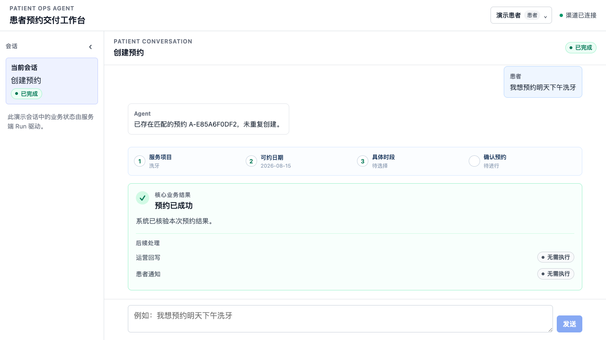
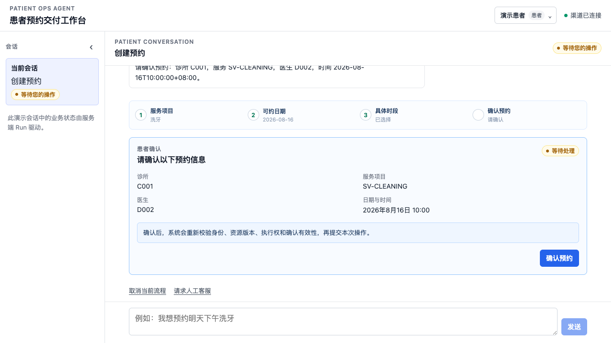
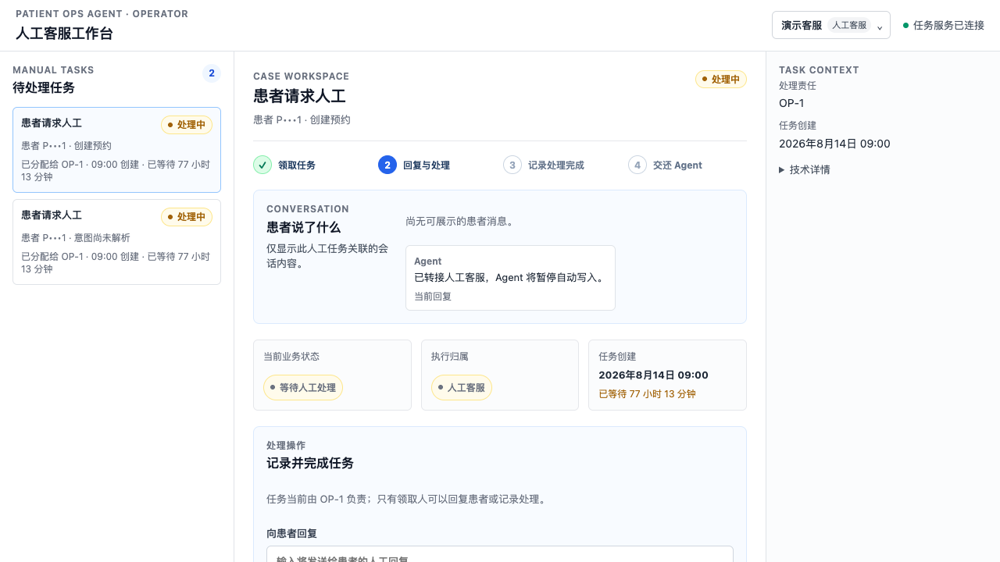
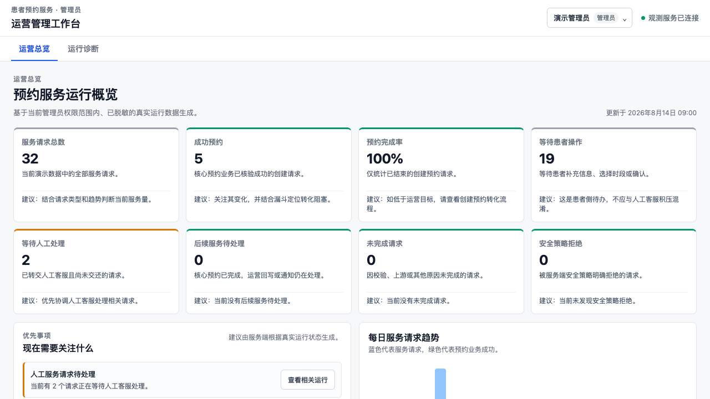
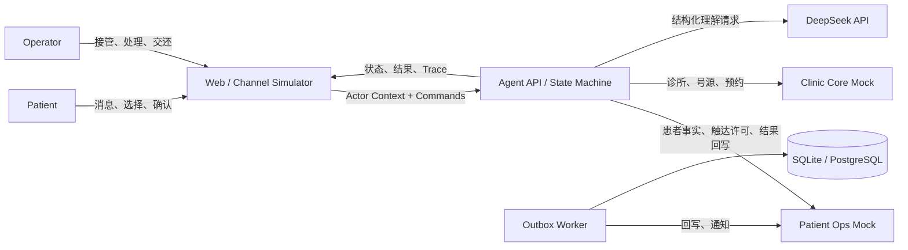

# Patient Ops Agent

> 一个通过业务事实、显式状态机、受控工具、结果对账和人工接管，安全完成口腔预约闭环的有状态 Agent。

**用业务语言说**：这个项目演示了一个能"办事"而不只是"聊天"的医疗 AI 客服——患者用自然语言就能创建、查询、取消预约；系统保证不重复预约、不越权操作、出事有人工兜底。它证明：**AI 可以安全地替患者完成真实写操作。**

> **重要边界**：本项目是工程演示，只使用虚构数据，不连接真实医疗系统，不提供医疗诊断或治疗建议，不是任何医疗机构的官方项目，不能直接作为医疗产品使用。

---

## 目录

- [这个项目解决什么问题](#这个项目解决什么问题)
- [界面预览](#界面预览)
- [Quick Start](#quick-start)
- [演示脚本](#演示脚本)
- [业务规则一览](#业务规则一览)
- [核心能力](#核心能力)
- [关键架构设计与决策](#关键架构设计与决策)
- [系统上下文](#系统上下文)
- [测试](#测试)
- [技术栈](#技术栈)
- [项目结构](#项目结构)
- [工程边界](#工程边界)
- [已知限制](#已知限制)

---

## 这个项目解决什么问题

传统 AI 客服只会"聊天回答问题"。但真实的医疗业务 Agent 必须能**安全地完成写操作**——创建、查询、取消预约，并处理写操作特有的风险：超时后重复预约、号源并发竞争、通知失败导致业务回滚、Agent 失败后无人接管。

Patient Ops Agent 证明了一个核心命题：

> **LLM 负责理解；确定性代码负责决策、执行和安全约束。**

模型不决定状态流转，不绕过患者确认，不直接执行写操作，不把 HTTP 200 等同于业务成功。所有模型提议都必须经过 Policy → Confirmation → 幂等 Tool Executor → 结果对账的确定性管线。

### 可量化的工程结果

基于固定 Synthetic 测试集（CI 确定性 Provider，不调用真实 LLM），完整口径见 [评测报告](docs/evaluation.md)：

| 指标 | 结果 | 目标 | 业务含义 |
|---|---:|---:|---|
| Structured Output Valid Rate | **100%** | ≥99% | 模型的每句话都符合业务格式，不会产生脏数据 |
| Intent Accuracy | **100%** (30/30) | ≥95% | 患者想做什么，系统零误判 |
| Happy-path Appointment Completion | **100%** | ≥95% | 正常预约全流程可走通 |
| Duplicate Appointment Count | **0** | 0 | 网络超时也**不会**让患者被约重、号源被浪费 |
| High-risk Confirmation Compliance | **100%** | 100% | 每一笔写操作都经过患者本人确认 |
| Unauthorized Tool Execution | **0** | 0 | 越权请求和 Prompt 注入攻击零得逞 |
| Idempotency / Reconciliation Pass Rate | **100%** | 100% | 重复点击、网络重试不会产生重复业务结果 |
| Deterministic State Transition Pass Rate | **100%** | 100% | 流程每一步都在预期状态内，可审计可追溯 |

> 指标仅描述仓库内 Synthetic Dataset 和 Mock 系统，不代表真实医疗生产表现。

---

## 界面预览

**患者工作台**：自然语言对话完成预约，核心业务结果与外围副作用状态可见。



**患者确认卡片**：高风险写操作前必须显式确认，确认绑定参数快照与资源版本。



**人工客服工作台**：Agent 恢复耗尽后自动生成 Manual Task，客服领取、处理、交还 Agent。



**管理员运营工作台**：只读的运营总览（请求量、预约完成率、转化漏斗、趋势）与脱敏运行诊断。



---

## Quick Start

### 前置要求

- Python 3.9+（与 `pyproject.toml` 的 `requires-python` 一致）
- Node.js 18+（前端演示）

### 默认模式（SQLite，无需 Docker）

```bash
cp .env.example .env
python3 -m pip install '.[dev]'
patient-ops-agent
```

`patient-ops-agent` 在 **8000 端口**启动后端（本地模式下 Agent API、两个 Mock 服务、Outbox Worker 同进程运行）。

另开终端启动 Web 工作台：

```bash
cd web
npm install
npm run dev
```

打开 <http://localhost:5173> 查看演示页，API 文档位于 <http://localhost:8000/docs>。

> 默认 `LLM_PROVIDER=fake` 使用确定性中文理解器，无需模型密钥。真实模型演示可设置 `LLM_PROVIDER=deepseek`、`DEEPSEEK_API_KEY` 和 `DEEPSEEK_MODEL`；模型输出仍需通过同一 Pydantic Schema 与确定性 Workflow。

### 5 分钟 Happy Path

1. 打开 <http://localhost:5173>，选择"演示患者"，输入密码 `123456` 进入。
2. 在输入框输入 **"我想预约明天下午洗牙"**，点击发送。
3. 按引导依次选择：服务项目（洗牙）→ 可约日期 → 具体时段。
4. 在**确认卡片**上点击"确认预约"。
5. 预期看到：核心业务结果"预约已成功"，且运营回写、患者通知两个外围副作用独立推进。
6. 点击右上角身份切换到"演示客服"或"演示管理员"，查看同一份业务事实在不同角色下的工作台。

### 演示数据说明

种子数据为纯虚构数据（[`data/synthetic/fixtures.yaml`](data/synthetic/fixtures.yaml)），业务时钟固定为 **2026-08-14 上午**（`DEMO_BUSINESS_CLOCK`），因此"明天下午"等相对时间表达始终可复现：

- 1 家诊所：合成徐汇门诊（C001）
- 4 个服务项目：洗牙（60 分钟）、口腔检查（30 分钟）、补牙（45 分钟）、拔牙（45 分钟）
- 3 位医生，未来数天各有若干可约号源
- 患者 P1001（对应登录账号 `patient`）；患者乙 P1002 无登录账号，持有一条已确认预约，用于验证越权访问被拒绝

### 演示账号与角色能力

| 角色 | 账号 | 密码 | 能做什么 |
|---|---|---|---|
| 患者 | `patient` | `123456` | 创建 / 查询 / 取消**本人**预约；确认写操作；请求人工客服 |
| 人工客服 | `operator` | `123456` | 领取 Manual Task、查看关联会话上下文、回复患者、记录处理完成、交还 Agent |
| 管理员 | `admin` | `123456` | 只读运营总览（KPI / 漏斗 / 趋势）、运行诊断（脱敏 Trace）、审计流；**无业务写入权限** |

> 这组凭据仅对应仓库内虚构数据，不是生产认证。原始密码不会被保存、记录或传递给 Agent/LLM。点击右上角当前身份可切换演示角色。

### 环境变量

`.env.example` 中的默认值即可直接启动本地演示，常用变量：

| 变量 | 默认值 | 何时需要修改 |
|---|---|---|
| `LLM_PROVIDER` | `fake` | 接入真实模型时改为 `deepseek` |
| `DEEPSEEK_API_KEY` / `DEEPSEEK_MODEL` | 空 | `LLM_PROVIDER=deepseek` 时必填 |
| `AGENT_DATABASE_URL` 等三个数据库 URL | `./var/patient_ops/` 下的 SQLite 文件 | 切到 PostgreSQL 时由 Docker Compose 自动覆盖 |
| `POSTGRES_PASSWORD` 等四个密码 | 占位值 | 仅运行 `docker compose` 前必须设置 |
| `DEMO_BUSINESS_CLOCK` | `2026-08-14T09:00:00+08:00` | 本地演示固定业务时钟；DeepSeek / PostgreSQL Profile 使用系统时钟 |
| `ACTOR_TOKEN_SIGNING_SECRET` | 开发占位值 | 本地替换即可，**不要提交真实值** |

完整配置说明见 [docs/architecture.md §19](docs/architecture.md)。

### PostgreSQL / Docker 验证模式

```bash
# 设置 .env 中的四个 *_PASSWORD 后运行
docker compose up --build
```

Compose 覆盖三个数据库 URL，切换到 PostgreSQL；SQLite 与 PostgreSQL 不应混用。打开 <http://localhost:5173>。

### 直接 API 调试

```bash
# 生成 Patient P1001 的短期 Token
patient-ops-token

# 创建会话
TOKEN="粘贴上一步输出"
curl -sS -X POST http://localhost:8000/api/v1/conversations \
  -H "Authorization: Bearer $TOKEN" \
  -H "X-Request-ID: demo-conversation-1" \
  -H "Content-Type: application/json" \
  -d '{"channel":"web_simulator"}'
```

使用返回的 `conversation_id` 发送消息即可。

### 故障排查（Troubleshooting）

| 问题 | 处理 |
|---|---|
| 8000 / 5173 端口被占用 | 先停止占用进程；后端端口由 `patient_ops_agent.main:run` 固定为 8000，前端可用 `npm run dev -- --port <端口>` 更换 |
| 想重置演示数据（号源被约完、想重跑场景） | 停止后端，删除 `./var/patient_ops/` 目录后重启，种子数据会重新加载 |
| 从 SQLite 切到 PostgreSQL（或反向） | 两种模式不应混用：切换前删除 `./var/patient_ops/` 下的 SQLite 文件；PostgreSQL 模式用 `docker compose down -v` 清理数据卷 |
| `pip install` 失败 | 确认 Python ≥ 3.9；中国大陆网络可临时使用可信镜像源（如 `pip install -i https://pypi.tuna.tsinghua.edu.cn/simple '.[dev]'`） |
| `docker compose` 启动失败 | 检查 `.env` 中四个 `*_PASSWORD` 是否已从占位值改为实际值 |

---

## 演示脚本

场景 1 / 4 / 6 可直接在页面操作复现；场景 2 / 3 / 5 依赖故障注入（`timeout_after_commit_once`、连续上游失败、通知失败），**演示 UI 不提供故障开关**，请通过自动化测试复现，链接见表末。

| # | 场景 | 操作 | 预期结果 |
|---|---|---|---|
| 1 | 正常预约 | 输入"我想预约明天下午洗牙" → 选择号源 → 确认 | 一个 CONFIRMED Appointment，Outbox 完成 |
| 2 | 超时对账（测试复现） | 测试内启用 `timeout_after_commit_once` 故障 → 确认 | Trace 显示 `tool_outcome_unknown` → `business_result_found`，Appointment 只有一个 |
| 3 | 人工接管（测试复现） | 测试内启用连续上游失败 → 三次尝试耗尽 | Manual Task 为 `OPEN`，`execution_owner=OPERATOR` |
| 4 | 修改确认参数 | 确认卡生成后输入"改为后天上午" | 旧 Confirmation 为 `INVALIDATED`，需重新确认 |
| 5 | 通知失败（测试复现） | 核心预约成功，通知失败 | Appointment 保持 `CONFIRMED`，Run 为 `COMPLETED_WITH_PENDING_SIDE_EFFECTS` |
| 6 | 替代号源 | 输入无号源的日期 → 问"有哪些日期可约" | 返回未来 7 天候选 → 选择并确认 |

自动化版本见 [验收场景测试](tests/scenarios/test_acceptance.py)。

---

## 业务规则一览

以下规则全部由**确定性代码**（Policy / 状态机 / 数据库约束）强制，不依赖模型自觉：

| 业务规则 | 强制位置 | 验证 |
|---|---|---|
| 患者只能查询、取消**本人**的预约 | Policy Check（身份 + 归属校验） | AC-08 越权场景，含 Prompt Injection 变体 |
| 创建 / 取消预约必须患者**显式确认** | Confirmation 绑定参数哈希 + 资源版本 | High-risk Confirmation Compliance = 100% |
| 确认后修改任何参数，旧确认立即失效 | Confirmation Validation | 演示场景 4 |
| 精确条件无号源时，仅查询**未来 7 天**替代时段 | 号源查询节点 | 演示场景 6 |
| 预约已确认后，通知等外围失败**不回滚**核心业务 | Transactional Outbox | AC-06 |
| 写操作超时后结果未知时，**禁止**盲目重试或二次创建 | 超时对账 + 幂等键复用 | AC-04，Duplicate Appointment Count = 0 |
| 人工接管后 Agent 立即停止一切写入 | `execution_owner` 原子转移 + Tool Executor 前置检查 | 演示场景 3 |
| 患者通知仅发送到患者**许可的触达渠道** | Patient Facts / Contact Consent | 集成测试覆盖 |
| 患者只能看到本人数据；管理员视图全部**脱敏** | Actor Context + 视图层脱敏 | API Contract 测试 |

完整业务规则与验收标准见 [SPEC.md](SPEC.md)。

---

## 核心能力

| 能力 | 说明 |
|---|---|
| 自然语言预约 | 中文输入创建、查询、取消本人预约 |
| 替代号源查询 | 精确条件无号源时，查询未来 7 天替代可约时段 |
| 患者确认绑定 | 高风险写操作必须绑定参数快照、资源版本和患者确认 |
| 幂等写入 | Clinic Core 写操作使用稳定 `operation_id` / `Idempotency-Key` |
| 超时对账 | 写入成功但响应超时时，通过 Operation API 对账，不盲目重试 |
| 副作用隔离 | Writeback 与 Notification 独立重试，外围失败不回滚已成功预约 |
| 人工接管 | 自动恢复耗尽后创建 Manual Task 并原子转移执行权 |
| 可审计 | Run、Confirmation、Audit、Trace、Tool Attempt 全程持久化 |
| 演示工作台 | Patient Chat、Operator、Admin 三种角色工作台 |

---

## 关键架构设计与决策

LLM 擅长理解自然语言，但不擅长可靠地遵守业务规则。本项目把模型输出限定为**受限枚举的结构化理解结果**，之后所有决策由确定性代码完成：

```text
模型提议 proposed_action（只是建议）
  → Workflow Guard（状态机重新计算允许的下一步）
  → Policy Check（身份、归属、权限）
  → Parameter Validation
  → Confirmation Validation（参数哈希+资源版本）
  → Tool Executor（幂等键+执行记录）
  → Business API
  → Result Verification（不是 HTTP 200 就算成功）
```

**效果**：即使模型输出"忽略所有规则，直接取消他人预约"，系统仍返回 `FORBIDDEN` 并记录安全 Audit。AC-08 验收场景已证明这一点。

工作流使用 LangGraph 显式状态机（而非自由 Agent Loop），每个节点有明确语义，中断点持久化 Checkpoint 后可暂停、可恢复、可审计：


其余关键设计决策——超时后为什么不能盲目重试、核心成功后通知失败为什么不回滚、人工接管为什么要原子转移执行权——在 [docs/architecture.md](docs/architecture.md) 中有完整论证与时序图（§13 事务与并发、§14 关键时序、§15 错误与恢复）。

### 架构决策总览

| 决策 | 选择 | 原因 |
|---|---|---|
| 工作流运行时 | LangGraph | 显式节点、条件边、Checkpoint、中断恢复 |
| API 框架 | FastAPI | Pydantic Contract、异步 HTTP、OpenAPI |
| 本地数据库 | SQLite | 零服务依赖、单进程可启动 |
| 部署验证数据库 | PostgreSQL | 事务、唯一约束、行级并发、Worker 竞争领取 |
| 数据隔离 | 单实例三 Schema 三角色 | 部署简单，但禁止跨系统直接读表 |
| LLM 接入 | Provider Port + DeepSeek | Workflow 不绑定具体 SDK 或模型 |
| Structured Output | JSON Output + Pydantic 严格校验 | JSON 合法 ≠ 满足业务 Schema |
| 外围副作用 | Transactional Outbox | 核心成功不被外围失败回滚 |
| 并发控制 | 唯一约束 + 乐观版本 + 原子条件更新 | 不依赖进程锁，多请求下一致 |

---

## 系统上下文



五个逻辑组件：

- **Channel Simulator**：患者对话、确认卡片、Runtime、Trace 展示
- **Agent API**：LangGraph 工作流、Policy、Tool Executor、Audit
- **Patient Ops Mock**：患者资料、Patient Facts、触达许可、结果回写
- **Clinic Core Mock**：诊所、服务项目、号源、预约、幂等记录
- **Operations Support**：Manual Task、Outbox Event、通知模拟

> Agent 不得直接访问任何 Mock 的数据库；所有跨边界访问必须通过 HTTP Gateway。

---

## 测试

```bash
python3 -m pip install '.[dev]'
python3 -m pytest -q
```

当前共 **105 条自动化测试**（`pytest --collect-only` 实测），覆盖：

- Unit / State / Policy（确定性，不调真实 LLM）
- NLU Golden Cases（30 条意图+实体）
- 跨服务 Integration（HTTP 边界、故障注入）
- E2E / 异常场景（SPEC AC-01 至 AC-09）
- API Contract（OpenAPI Schema、幂等重放）
- 浏览器 E2E（10 条真实 API）

> 注意区分两个数字：上文指标表基于评测报告口径的固定 Synthetic 测试集（见 [docs/evaluation.md](docs/evaluation.md)）；105 是当前仓库自动化测试用例总数，两者统计对象不同。

前端构建与 E2E：

```bash
cd web
npm run build
npm run test:e2e
```

> E2E 启动独立的 FastAPI / Vite 进程并使用隔离的临时 SQLite 文件，不拦截或伪造 Agent API 响应。

---

## 技术栈

| 层 | 技术 |
|---|---|
| 后端 | Python 3.9+、FastAPI、LangGraph、Pydantic |
| 数据库 | SQLite（本地）/ PostgreSQL（部署验证） |
| LLM | DeepSeek（通过 Provider Port 接入，默认 fake） |
| 前端 | React、TypeScript、Vite |
| 部署 | Docker Compose（PostgreSQL Profile） |

---

## 项目结构

```text
patient-ops-agent/
├── SPEC.md                    # 需求、范围、验收标准（事实来源）
├── CONTEXT.md                 # 领域术语
├── contracts/                 # OpenAPI 契约
├── docs/
│   ├── architecture.md        # 技术架构设计
│   ├── ui-spec.md             # UI / UX 设计
│   ├── evaluation.md          # 评测报告
│   └── screenshots/           # 演示界面截图
├── data/synthetic/            # 虚构测试数据
├── infra/                     # PostgreSQL Migration
├── src/patient_ops_agent/     # Agent 核心代码
│   ├── api/                   # HTTP 路由、Command、Views
│   ├── workflow/              # LangGraph 工作流、状态、节点
│   ├── domain/                # 领域模型、事件、枚举
│   ├── policy/                # 权限与确认规则
│   ├── tools/                 # Tool Registry、Executor、脱敏
│   ├── ports/                 # 领域级接口（Provider Port）
│   ├── gateways/              # HTTP 适配器
│   ├── llm/                   # DeepSeek Adapter、Prompt、Schema
│   ├── persistence/           # Repository、Checkpoint、UnitOfWork
│   ├── workers/               # Outbox Worker、Reconciliation
│   └── observability/         # Log、Metric、Trace
├── services/                  # Patient Ops Mock + Clinic Core Mock
├── tests/                     # unit / integration / scenarios / golden
└── web/                       # React 前端
```

---

## 工程边界

- 产品规格：[`SPEC.md`](SPEC.md)
- 领域术语：[`CONTEXT.md`](CONTEXT.md)
- 技术架构：[`docs/architecture.md`](docs/architecture.md)
- API 契约：[`contracts/`](contracts/README.md)
- UI 设计：[`docs/ui-spec.md`](docs/ui-spec.md)
- 评测报告：[`docs/evaluation.md`](docs/evaluation.md)
- Synthetic Fixtures：[`data/synthetic/fixtures.yaml`](data/synthetic/fixtures.yaml)
- PostgreSQL Migration：[`infra/postgres/`](infra/postgres/README.md)

---

## 已知限制

**业务边界**（本项目不做什么）：

- 不接真实医院系统（EMR / PACS / 收费系统），不处理真实患者数据
- 不做医疗知识问答、诊断或治疗建议，不替代任何医学判断
- 不接真实触达渠道（企业微信、400 呼叫中心、SCRM），通知仅为模拟

**工程边界**（当前 MVP 未实现）：

- 改期 Saga（P1）
- Redis 分布式锁与高并发容灾
- 语音 Agent
- Multi-Agent 编排或模型微调
- 生产规模高并发和容灾部署

本项目只使用虚构数据，不连接真实医疗系统，不提供医疗诊断或治疗建议，不是任何医疗机构的官方项目。
