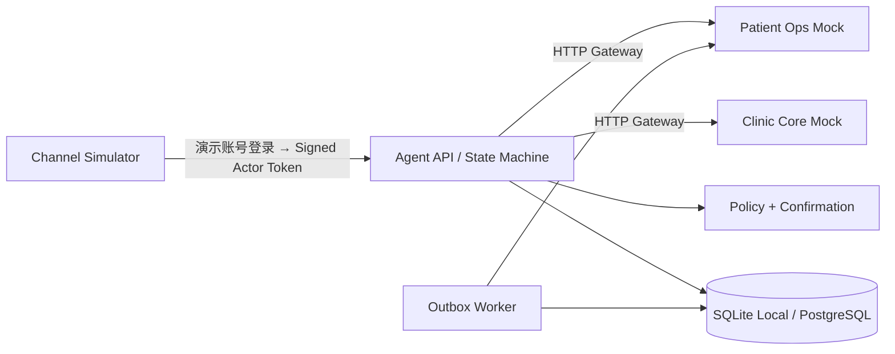

# Patient Ops Agent

Patient Ops Agent 是一个面向口腔预约交付的有状态 Agent MVP。它演示的重点不是“模型会聊天”，而是自然语言请求如何经过显式状态机、患者确认、确定性 Policy、幂等 Tool Executor、结果对账和人工接管，安全地完成业务操作。

本项目只使用虚构数据，不连接真实医疗系统，不提供医疗诊断或治疗建议，也不是任何医疗机构的官方项目。

## 核心能力

- 用中文自然语言创建、查询和取消本人预约；
- 精确条件无号源时，可在当前预约上下文中查询未来 7 天的替代可约时段；
- 高风险写操作必须绑定患者确认、完整参数快照和资源版本；
- Clinic Core 写操作使用稳定 `operation_id` / `Idempotency-Key`；
- 写入成功但响应超时时，通过 Operation API 对账，不盲目重试；
- SQLite（本地）或 PostgreSQL（部署验证）持久化 Run、Confirmation、Audit、Trace、Tool Attempt 和 Outbox；
- Writeback 与 Notification 独立重试，外围失败不回滚已成功预约；
- 自动恢复耗尽后创建 Manual Task 并原子转移执行权；
- 提供 Patient Chat、Runtime 和 Trace 三栏演示页，以及右上角的安全账号切换入口。



模型只生成受限的结构化理解结果。Workflow 会重新计算下一步；身份、归属、确认、执行权、幂等和业务结果核验均由确定性代码执行。

## Quick Start

默认使用 SQLite，不需要 Docker 或单独安装数据库。首次启动：

```bash
cp .env.example .env
python3 -m pip install '.[dev]'
patient-ops-agent
```

另开一个终端启动独立 Web 工作台：

```bash
cd web
npm install
npm run dev
```

打开 <http://localhost:5173> 查看演示页，API 文档位于 <http://localhost:8000/docs>。Vite 开发服务器会将 `/api` 请求代理到本地 FastAPI；浏览器不会直接接触 Mock 服务或 LLM。

前端构建与端到端检查：

```bash
cd web
npm run build
npm run test:e2e
```

E2E 会启动独立的 FastAPI / Vite 进程并使用隔离的临时 SQLite 文件，验证患者预约主流程、人工接管、账号切换、响应式布局和基础键盘焦点；它不拦截或伪造 Agent API 响应。

在页面选择演示身份并登录即可，系统会在后台签发短期 Synthetic Actor Token；患者身份会自动创建会话：

| 角色 | 账号 | 密码 |
| --- | --- | --- |
| 患者 | `patient` | `123456` |
| 人工客服 | `operator` | `123456` |
| 管理员 | `admin` | `123456` |

这组凭据仅对应仓库内的虚构患者数据，不是生产认证，不能用于真实患者系统。页面不会展示或要求填写 Token、患者 ID、会话 ID；原始密码不会被保存、记录或传递给 Agent/LLM。

登录后，点击右上角的当前身份可打开账号菜单，选择“切换演示身份”并重新输入目标账号密码即可进入相应工作台（患者、人工客服或管理员）。切换会清除当前浏览器内存中的 Token 和页面状态，不会取消、修改或交还原身份已发起的预约及人工任务；服务端仍以新签发 Token 的角色进行授权。

本地 SQLite 文件位于 `./var/patient_ops/`，已被 Git 忽略。Agent API、两个 Mock 和 Outbox Worker 会在同一进程中运行，但仍保留 HTTP Gateway 边界，适合开发和演示。

### PostgreSQL / Docker 验证模式

PostgreSQL 保留用于接近部署的多进程、并发和 Worker 验证。Docker 镜像会安装可选的 `postgres` 驱动组；如需在宿主机直接运行该模式，先执行 `python3 -m pip install '.[postgres]'`。设置 `.env` 中的四个 `*_PASSWORD` 后运行：

```bash
docker compose up --build
```

Compose 会覆盖三个数据库 URL，自动切换到 PostgreSQL；SQLite 与 PostgreSQL 不应混用。独立 Web 容器由 Nginx 托管并代理 Agent API，打开 <http://localhost:5173>。

如需直接调试受保护 API，可生成 Patient P1001 的短期 Synthetic Actor Token：

```bash
patient-ops-token
```

再创建会话：

```bash
TOKEN="粘贴上一步输出"
curl -sS -X POST http://localhost:8000/api/v1/conversations \
  -H "Authorization: Bearer $TOKEN" \
  -H "X-Request-ID: demo-conversation-1" \
  -H "Content-Type: application/json" \
  -d '{"channel":"web_simulator"}'
```

直接 API 调试时使用返回的 `conversation_id` 发送消息；日常演示则只需登录页面并输入“我想预约明天下午洗牙”。页面会显示候选号源、Run 状态和 Trace；号源选择和确认也可以在 `/docs` 中完成。

默认 `LLM_PROVIDER=fake` 使用确定性中文理解器，无需模型密钥。真实模型演示可设置 `LLM_PROVIDER=deepseek`、`DEEPSEEK_API_KEY` 和 `DEEPSEEK_MODEL`；模型输出仍需通过同一 Pydantic Schema 与确定性 Workflow。

本地 fake 演示默认固定业务时钟为 `2026-08-14T09:00:00+08:00`，因此“明天下午洗牙”会命中 fixtures 中 8 月 15 日下午的号源。可用 `DEMO_BUSINESS_CLOCK` 覆盖；若精确条件无号源，可继续问“有哪些日期可约”，系统会在未来 7 天内返回相同服务的替代候选，选择后仍需要确认预约。

## 测试与指标

本地开发要求 Python 3.9+：

```bash
python3 -m pip install '.[dev]'
python3 -m pytest -q
```

当前固定数据集包含 101 条可重复测试，覆盖 unit/state/policy、NLU Golden、跨服务集成、端到端/异常场景与 API 契约；SPEC AC-01 至 AC-09 均有独立自动化场景；另有 10 条真实 API 的浏览器 E2E。最新实测结果及口径见 [评测报告](docs/evaluation.md)。

| 指标 | 固定测试集结果 |
|---|---:|
| Structured Output Valid Rate | 100% |
| Intent Accuracy | 100% |
| Happy-path Appointment Completion | 100% |
| Duplicate Appointment Count | 0 |
| High-risk Confirmation Compliance | 100% |
| Unauthorized Tool Execution | 0 |
| Idempotency / Reconciliation Pass Rate | 100% |
| Deterministic State Transition Pass Rate | 100% |

这些指标只描述仓库内的 Synthetic Dataset 和 Mock 系统，不代表真实医疗生产表现。

## 演示脚本

1. 正常预约：创建会话 → 输入“我想预约明天下午洗牙” → 选择号源 → 确认 → 观察 Outbox 完成。
2. 超时对账：启用 Clinic Core `timeout_after_commit_once` 故障 → 确认 → Trace 显示 `tool_outcome_unknown`、`business_result_found`，Appointment 只有一个。
3. 人工接管：启用连续上游失败 → 三次同 Operation 尝试耗尽 → Manual Task 为 `OPEN`，`execution_owner=OPERATOR`。转人工后患者仍可在原会话补充信息，人工客服可继续回复；Agent 自动推进和写操作保持暂停，交还 Agent 后才恢复。
4. 修改确认参数：确认卡生成后输入“改为后天上午” → 旧 Confirmation 为 `INVALIDATED`。
5. 通知失败：核心预约保持 `CONFIRMED`，Run 为 `COMPLETED_WITH_PENDING_SIDE_EFFECTS`，通知进入重试。
6. 替代号源：输入“我想预约2026年8月16日下午洗牙”后，再问“有哪些日期可约” → 返回未来 7 天候选 → 选择并确认。

自动化版本位于 [验收场景测试](tests/scenarios/test_acceptance.py)。

## 工程边界

- API 契约：[`contracts/`](contracts/README.md)
- 产品规格：[`SPEC.md`](SPEC.md)
- 技术架构：[`docs/architecture.md`](docs/architecture.md)
- Synthetic Fixtures：[`data/synthetic/fixtures.yaml`](data/synthetic/fixtures.yaml)
- PostgreSQL Migration（Docker / 部署验证）：[`infra/postgres/`](infra/postgres/README.md)

当前 MVP 不包含改期 Saga、真实渠道、Redis、高并发容灾、EMR/PACS/收费、医疗知识 RAG 或医学决策。
