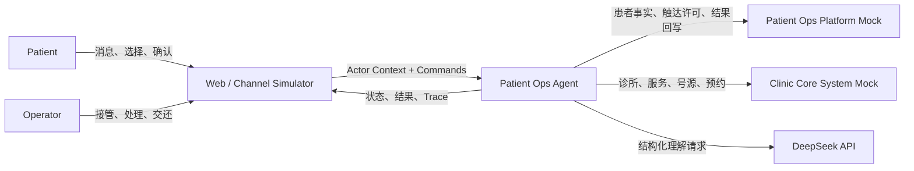
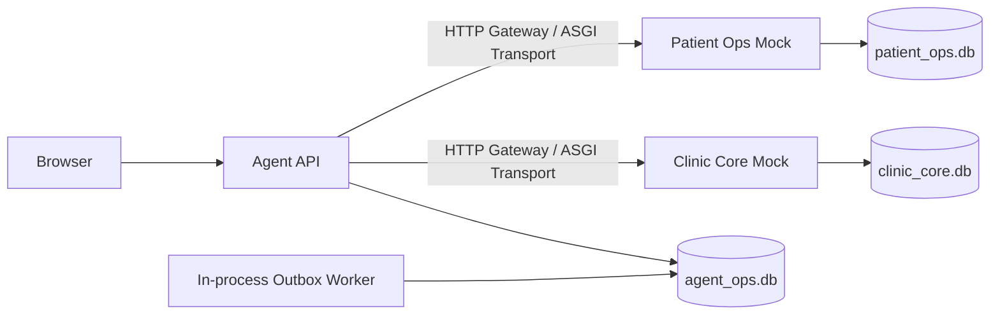
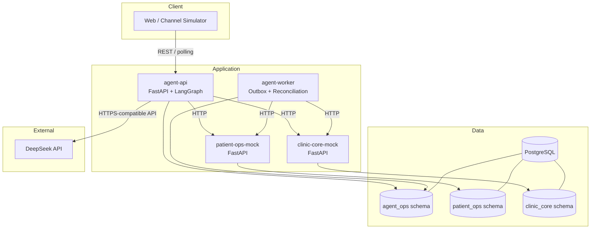
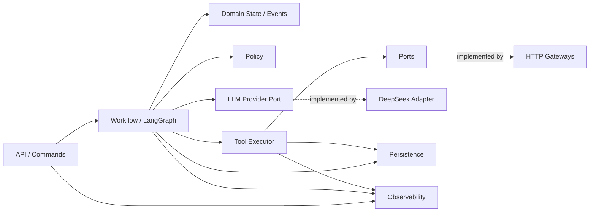
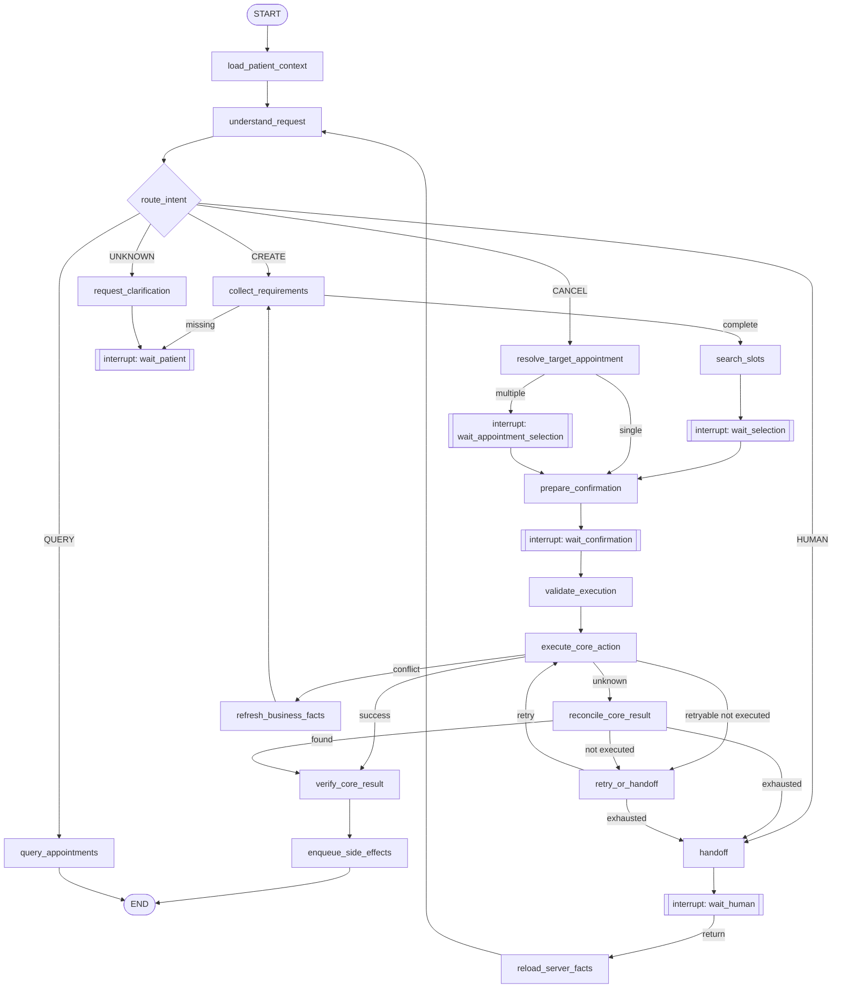
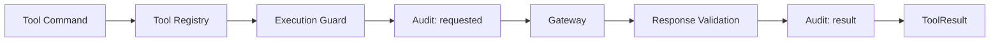
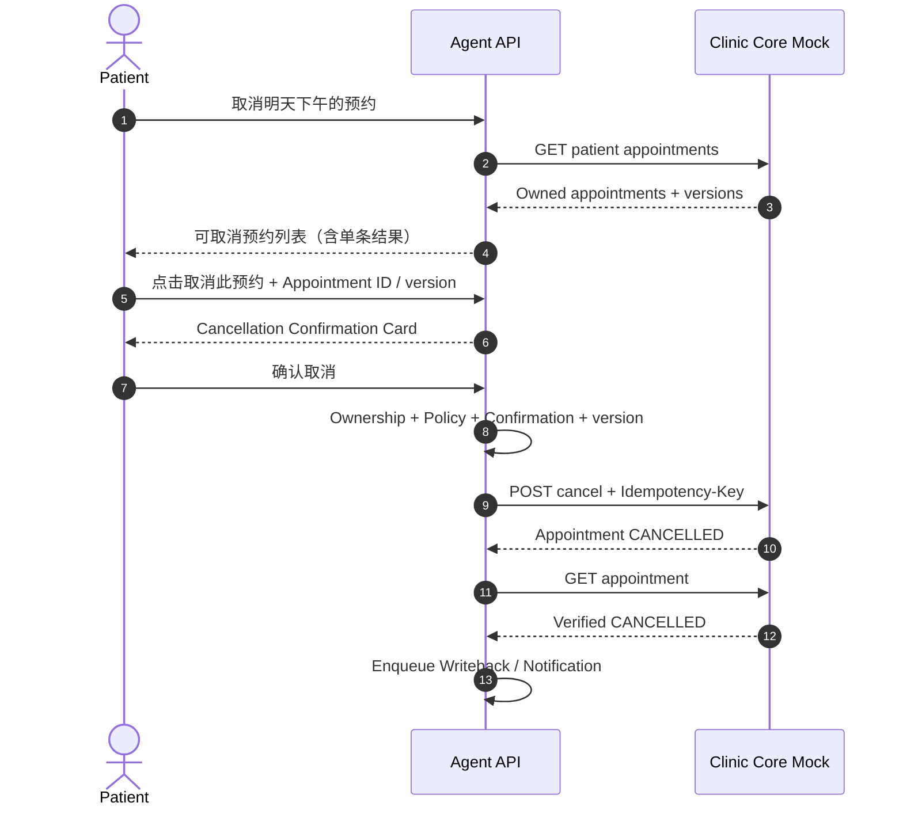

# Patient Ops Agent 技术架构

> 本文定义 Patient Ops Agent MVP 的整体技术设计。需求、业务范围和验收标准以 [`SPEC.md`](../SPEC.md) 为准；领域术语以 [`CONTEXT.md`](../CONTEXT.md) 为准。

---

## 1. 文档信息

| 项目 | 内容 |
|---|---|
| 文档职责 | 整体技术设计 |
| 对应规格 | `SPEC.md` v0.4 |
| 架构范围 | 创建预约、查询预约、取消预约、人工接管 |
| 核心运行时 | Python、FastAPI、LangGraph、SQLite（本地）/ PostgreSQL（部署验证） |
| LLM Provider | DeepSeek，通过 Provider Adapter 接入 |
| 部署目标 | 默认本地单进程 SQLite；Docker Compose PostgreSQL 验证 Profile |
| 文档状态 | MVP Baseline |

本文只描述“如何实现”SPEC 已确定的行为，不重新定义业务需求。发生冲突时，以 SPEC 为准并先修正文档，不通过代码反向修改需求。

---

## 2. 架构目标与约束

### 2.1 架构目标

系统需要证明：

1. 自然语言理解与确定性业务执行可以清晰分离；
2. Agent Run 可以暂停、持久化、恢复和审计；
3. 患者运营平台与诊所核心系统通过明确 API 边界集成；
4. 高风险写操作必须经过身份、归属、Policy 和 Patient Confirmation；
5. 超时、重复请求、号源竞争和部分成功能够确定性恢复；
6. Human Handoff 不只是创建任务，还会转移执行权；
7. 业务结果、运营回写和患者通知分别可观察。

### 2.2 架构约束

- Agent 不得直接访问 Patient Ops 或 Clinic Core 的数据表；
- LLM 不得直接调用创建或取消预约 Tool；
- 不使用真实患者数据；
- 不引入 Redis，除非后续测试证明 PostgreSQL 部署 Profile 不能满足需求；
- 不实现修改预约 Saga、EMR、PACS、收费或真实渠道；
- 不依赖单次进程内存保存关键状态；
- 所有时间使用带时区时间戳，业务默认时区为 `Asia/Shanghai`；
- 所有外部写操作必须可幂等、可追踪、可对账。

### 2.3 关键技术决策

| 决策 | 选择 | 原因 |
|---|---|---|
| 工作流运行时 | LangGraph | 支持显式节点、条件边、Checkpoint 与人工中断恢复 |
| API 框架 | FastAPI | 统一 Pydantic Contract、异步 HTTP 与 OpenAPI 输出 |
| 本地数据库 | SQLite | 零服务依赖、单进程演示和可恢复状态 |
| 部署验证数据库 | PostgreSQL | 验证事务、唯一约束、行级并发和 Outbox Worker 竞争领取 |
| 数据隔离 | 单 PostgreSQL 实例、三个 Schema、三个数据库角色 | 保持本地部署简单，同时防止跨系统直接读表 |
| 外部集成 | Gateway + Tool Executor | 将 HTTP、重试、错误映射与业务流程解耦 |
| LLM 接入 | Provider Port + DeepSeek Adapter | 避免 Workflow 绑定具体 SDK、模型或响应格式 |
| Structured Output | DeepSeek JSON Output + Pydantic 严格校验 | JSON 合法不等于满足业务 Schema，必须二次校验 |
| 外围副作用 | Transactional Outbox | 核心业务成功后，回写与通知失败可独立重试 |
| 并发控制 | 业务唯一约束 + 乐观版本 + 原子条件更新 | 避免依赖进程锁，保证多请求下一致行为 |

这些选择均服务于 MVP。没有真实权衡需要长期解释前，不额外创建 ADR；出现不可逆或存在重大替代方案的决策时再记录到 `docs/adr/`。

---

## 3. 质量属性

| 属性 | MVP 目标 | 架构策略 |
|---|---|---|
| 安全性 | 未授权写 Tool 调用为 0 | Actor Context、资源归属、Policy、Confirmation、执行权检查 |
| 一致性 | 重复预约为 0 | Operation、Idempotency Record、Slot 原子更新、唯一约束 |
| 可恢复性 | UNKNOWN Outcome 可对账 | Checkpoint、Operation Result API、Reconciliation 节点 |
| 可审计性 | 关键决策可重放解释 | Audit Event、Tool Attempt、State Transition、Trace ID |
| 可测试性 | 确定性层不依赖真实 LLM | Provider Fake、Clock Port、Gateway Stub、故障注入 |
| 可替换性 | Mock 可替换为真实系统适配器 | Port / Gateway 边界，不泄漏外部 DTO 到 Domain |
| 可运维性 | 能定位一次 Run 的失败位置 | Structured Log、Trace、Run Detail、Health Check |
| 简单性 | 单机可启动 | 默认 SQLite；可选 Docker Compose PostgreSQL；无 Redis |

---

## 4. 系统上下文



### 4.1 信任边界

| 边界 | 输入可信度 | 处理方式 |
|---|---|---|
| Patient → Web | 不可信自然语言 | 长度限制、内容记录策略、不得作为权限依据 |
| Web → Agent | 演示账号凭据、随后为 Actor Context | `/auth/demo-accounts` 仅返回无密码的 fixture 账号目录；`/auth/login` 校验所选账号并签发含 `PATIENT`、`OPERATOR` 或 `ADMIN` 角色的短期 Synthetic Token；不记录原始密码，所有资源 API 再次验证角色与范围 |
| Agent → DeepSeek | 仅最小必要上下文 | 不发送真实 PII、病历、Token 或内部权限信息 |
| Agent → Mock APIs | 外部系统响应不可信 | Timeout、Schema Validation、业务字段核验 |
| Operator → Agent | 受控管理操作 | Operator 身份、任务所有权、Audit、乐观锁 |
| Administrator → Agent | 只读运行观测 | Admin 身份、脱敏 Run / Trace / Audit 投影；不授予患者业务写命令 |

---

## 5. 运行 Profile 与容器拓扑

### 5.1 SQLite 本地 Profile

默认开发命令 `patient-ops-agent` 使用三个 SQLite 文件：Agent Operations、Patient Ops Mock 和 Clinic Core Mock。它在一个进程中托管 Agent API、两个 Mock 与 Outbox Worker；Agent 与 Mock 之间仍使用 HTTP Gateway 的 ASGI Transport，因此不改变跨边界调用契约。

当 `LLM_PROVIDER=fake` 时，本地 Profile 默认使用与 Synthetic Fixtures 对齐的固定演示时钟 `2026-08-14T09:00:00+08:00`，避免示例中的相对日期随真实日历失效。`DEMO_BUSINESS_CLOCK` 可覆盖该值；真实 Provider 与 PostgreSQL 部署 Profile 继续使用 `SystemClock`。该时钟只影响自然语言相对日期、Confirmation TTL 与本地 Worker 调度，不修改 Clinic Core 返回的业务事实。



SQLite Profile 的边界：单机、单进程演示与状态恢复；不将 SQLite 的单写者锁语义作为多 Worker 或高并发结论。`var/patient_ops/` 下的本地数据库文件不进入版本库。

### 5.2 PostgreSQL 容器验证 Profile



### 5.3 PostgreSQL Profile 进程职责

| 进程 | 职责 | 不负责 |
|---|---|---|
| `agent-api` | 对话命令、LangGraph 执行、确认、Policy、人工操作 API、查询 Run | 后台轮询重试、直接修改 Mock 数据 |
| `agent-worker` | 领取 Outbox、执行运营回写和通知、驱动延迟 Reconciliation | 解析患者自然语言、改变业务规则 |
| `patient-ops-mock` | Patient、Fact、Consent、NBA、AgentResult | 预约、Agent State、LLM 调用 |
| `clinic-core-mock` | Clinic、Service Item、Doctor、Slot、Appointment、外部幂等结果 | 患者运营事实、Agent Run |
| `web` | Chat、Confirmation Card、Runtime、Trace、Operator View | Policy、业务状态判定 |

`Operations Support` 在 MVP 中不是独立微服务：Manual Task、Outbox 和通知模拟由 Agent Operations 模块拥有，通过 `agent-api` 和 `agent-worker` 两个进程暴露能力。这样保留逻辑边界，同时避免无必要的服务拆分。

### 5.4 PostgreSQL Docker 部署

Docker Compose 最少包含：

```text
postgres
agent-api
agent-worker
patient-ops-mock
clinic-core-mock
web（React 构建产物 + Nginx，同源代理 `/api`）
```

DeepSeek 是外部服务，不进入 Compose。无 `DEEPSEEK_API_KEY` 时，确定性测试和本地固定响应模式仍应可运行；真实自然语言演示才要求密钥。

---

## 6. 组件职责与依赖方向

### 6.1 Agent 内部模块



依赖方向：

```text
API / Worker
→ Application Workflow
→ Domain + Policy + Ports
← Infrastructure Adapters
```

Domain 和 Policy 不得 import FastAPI、数据库 ORM、HTTP Client、DeepSeek SDK 或 LangGraph 的具体持久化实现。

### 6.2 模块说明

| 模块 | 输入 | 输出 |
|---|---|---|
| `api` | HTTP Command、Actor Context | Command Result、Run View |
| `workflow` | Domain Event、Checkpoint State | 下一节点、Tool Command、Patient Reply |
| `domain` | 已验证数据 | State、Event、Value Object、Enum |
| `policy` | Actor、State、Action、Confirmation | Allow / Deny + Reason Code |
| `tools` | 已获准 Tool Command | 统一 Tool Result |
| `ports` | 领域级请求 | 领域级响应或统一错误 |
| `gateways` | 领域级请求 | HTTP DTO 映射、Timeout、Correlation ID |
| `llm` | Prompt Input | `UnderstandingResult` |
| `persistence` | Repository Command | 事务、Checkpoint、Audit、Outbox |
| `observability` | Trace Context、Event | Log、Metric、Trace |

### 6.3 禁止依赖

- Workflow 不得直接构造 HTTP 请求；
- API Controller 不得直接调用 Clinic Core；
- Gateway 不得决定 Workflow 下一状态；
- Pydantic 外部 DTO 不得直接作为 Domain Entity；
- DeepSeek Adapter 不得访问 Repository 或执行 Tool；
- Web 不得通过隐藏接口绕过 Confirmation 和 Policy。

---

## 7. Agent API 边界

以下是架构级资源边界，精确 Schema 已落盘于 [`contracts/`](../contracts/)。

### 7.1 Patient Commands

```text
POST /api/v1/conversations
POST /api/v1/conversations/{conversation_id}/messages
POST /api/v1/runs/{run_id}/service-selection
POST /api/v1/runs/{run_id}/date-selection
POST /api/v1/runs/{run_id}/slot-selection
POST /api/v1/runs/{run_id}/confirmations
POST /api/v1/runs/{run_id}/cancel
POST /api/v1/runs/{run_id}/handoff
GET  /api/v1/runs/{run_id}
GET  /api/v1/runs/{run_id}/trace
```

### 7.2 Operator Commands

```text
GET  /api/v1/manual-tasks
POST /api/v1/manual-tasks/{task_id}/assign
POST /api/v1/manual-tasks/{task_id}/resolve
POST /api/v1/manual-tasks/{task_id}/return-to-agent
```

角色化读取接口使用同一份服务端签名 Token：

```text
GET  /api/v1/manual-tasks/{task_id}/context    # Operator：任务关联的脱敏 Run 与 Trace
POST /api/v1/manual-tasks/{task_id}/messages   # Operator：已领取任务的人工回复
GET  /api/v1/admin/dashboard                   # Admin：服务端聚合的运营总览、图表数据与确定性待关注事项
GET  /api/v1/admin/runs                        # Admin：只读 Run Summary
GET  /api/v1/admin/runs/{run_id}               # Admin：只读 Run Detail
GET  /api/v1/admin/runs/{run_id}/trace         # Admin：Sanitized Trace
GET  /api/v1/admin/audit                       # Admin：由持久化 Trace 投影出的运行审计事件
```

这些接口不接受前端传入的角色、患者 ID 或权限范围；角色来自 Token，患者标识只以脱敏形式返回。`/admin/dashboard` 在服务端读取同一 Admin 授权范围内的 Run 与 Sanitized Trace，聚合请求量、预约完成、状态 / 意图 / 错误分布、创建预约漏斗和按日趋势，并仅按确定性规则输出待关注类别与关联 Run ID；不返回患者原文、不计算未定义的 SLA，也不授予写权限。`/manual-tasks/{task_id}/context` 仅返回该 Task 关联的患者消息；`/messages` 要求 Task 已分配给当前 Operator，回复正文存入 Run 的任务级会话记录而不写入 Trace `details`。人工接管期间，Patient 的消息也写入同一任务级会话记录并由 Operator 工作台刷新读取，但不会触发 Agent 理解、Workflow 推进或写操作。该回复不会改变执行权、自动推进业务状态或替代 Patient Confirmation。会话记录能力上线前的历史 Manual Task 不回填患者正文：没有经授权的原始渠道记录时，页面必须显示为空而非从 Trace 推断。Patient 的 `/runs/*` 资源继续由 Patient 归属校验保护，不能被 Operator 或 Admin Token 调用。

`RunView.suggested_replies` 是服务端基于当前运行状态计算的受控输入辅助，包含显示文案、可填入的消息和交互模式。当前仅支持 `FILL_COMPOSER`：浏览器只能将消息填入 Composer 并等待患者主动发送，不能自动提交、解析 `current_reply` 生成建议或把建议视为确认/写操作。服务端在处理下一条患者消息时清空旧建议，避免跨状态复用。

创建预约的缺失信息使用同一 Run 的结构化引导，而不是 Web 直连 Clinic Core 或静态字典：服务端在 `SERVICE_SELECTION` 投影当前可用 `candidate_service_items`，在患者选择稳定 `service_item_id` 后查询 Clinic Core 的可用 Slot，并在 `DATE_SELECTION` 投影按日期聚合的 `candidate_dates`。日期选择后才投影具体 `candidate_slots`。`service-selection` 和 `date-selection` 是带 `state_version` 的 Agent 状态 Command，不调用 Clinic Core 写接口；它们仅允许 Patient、仅在 `execution_owner = AGENT` 时执行。前端使用返回的最新 `RunView` 覆盖旧候选，最终创建仍须经 Slot 选择和 Patient Confirmation。

预约查询沿用 Clinic Core 的 `Appointment` 展示 DTO：稳定的 `clinic_id`、`service_item_id`、`doctor_id` 用于业务关联，同时由 Clinic Core 解析并返回 `clinic_name`、`service_item_name`、`doctor_name` 供患者页面展示。Web 只消费这些名称；名称缺失时才显示稳定 ID，不维护客户端业务名称字典。

### 7.3 Command 规则

- 每个 Command 携带 `request_id`；
- 写 Command 使用 Actor Token 并校验 `state_version`；
- Confirmation Command 携带服务器生成的 `confirmation_id`，不接受客户端自造业务参数；
- API 返回最新 Run View，不把内部 Checkpoint 完整暴露给客户端；
- HTTP 成功仅代表命令被接受，业务完成状态以 Run View 为准；
- 重复 Command 使用 `request_id` 返回原结果或当前资源状态。

---

## 8. 外部系统 API 边界

### 8.1 Patient Ops Mock

```text
GET  /api/v1/patients/{patient_id}/context
GET  /api/v1/patients/{patient_id}/facts
GET  /api/v1/patients/{patient_id}/contact-consents/{channel}
GET  /api/v1/patients/{patient_id}/next-best-actions
POST /api/v1/agent-results
GET  /api/v1/operations/{operation_id}
```

`POST /agent-results` 必须支持 `Idempotency-Key`，确保 Writeback Worker 重试不会产生重复结果。

### 8.2 Clinic Core Mock

```text
GET  /api/v1/clinics
GET  /api/v1/service-items
GET  /api/v1/slots
GET  /api/v1/patients/{patient_id}/appointments
GET  /api/v1/appointments/{appointment_id}
POST /api/v1/appointments
POST /api/v1/appointments/{appointment_id}/cancel
GET  /api/v1/operations/{operation_id}
```

Clinic Core 所有写接口：

- 要求 `Idempotency-Key`；
- 请求体包含相同 `operation_id`；
- 保存 `request_hash`；
- 返回 `outcome` 或可查询 Operation Result；
- 使用资源版本防止过期确认执行。

### 8.3 统一 Gateway 结果

外部 API 的 HTTP 状态和错误体统一映射为：

```python
class ToolResult[T]:
    status: Literal["SUCCEEDED", "FAILED", "OUTCOME_UNKNOWN"]
    outcome: Literal["EXECUTED", "NOT_EXECUTED", "UNKNOWN"]
    data: T | None
    error_code: str | None
    retryable: bool
    correlation_id: str | None
```

Workflow 只处理统一结果，不依赖某个 Mock API 的原始异常类型。

---

## 9. LangGraph 工作流设计

### 9.1 顶层图



### 9.2 节点分类

| 类型 | 节点 | 特性 |
|---|---|---|
| LLM 节点 | `understand_request` | 只产生结构化理解，不写业务系统 |
| 只读 Tool 节点 | `load_patient_context`、`search_slots`、`query_appointments` | 可按策略重试，无 Patient Confirmation |
| 确定性节点 | `route_intent`、`prepare_confirmation`、`validate_execution` | 纯规则，可单元测试 |
| 高风险 Tool 节点 | `execute_core_action` | 必须消费有效 Confirmation 和 Operation |
| 恢复节点 | `reconcile_core_result`、`retry_or_handoff` | 不生成新 Operation |
| 副作用节点 | `enqueue_side_effects` | 只落 Outbox，不同步依赖通知成功 |
| 中断节点 | `wait_patient`、`wait_selection`、`wait_confirmation`、`wait_human` | Checkpoint 后暂停，收到 Command 再恢复 |

### 9.3 Checkpoint 与恢复

- `thread_id = run_id`；
- 每个外部 Tool 调用前后都产生可恢复 Checkpoint；
- Checkpoint 存入 `agent_ops` Schema；
- Checkpoint 是控制流恢复游标，不是 Appointment、Operation、Confirmation 或执行权的权威事实来源；
- 业务索引字段同时投影到 `agent_runs`，不通过反序列化完整 State 完成列表查询；
- 恢复 Run 时先加载 Checkpoint，再以 Domain 表和外部系统事实覆盖可能过期的关键字段；
- 不允许以客户端提交的 State 覆盖服务器 Checkpoint；
- 写 Tool 调用前的 Checkpoint 或 Operation 持久化失败时，不得调用外部系统；
- 写 Tool 已经发送后 Checkpoint 失败时，将结果视为可能不确定，通过 Operation 和 Reconciliation 恢复，不重新生成 Operation。

### 9.4 Interrupt 语义

LangGraph Interrupt 只表达“等待外部输入”，业务状态仍需显式落库：

```text
WAITING_SELECTION       → run_status = WAITING_PATIENT
WAITING_CONFIRMATION    → run_status = WAITING_PATIENT
NEED_HUMAN              → run_status = WAITING_HUMAN
```

恢复命令必须携带当前 `state_version`。版本不匹配时返回冲突并要求客户端刷新，不直接覆盖新状态。

### 9.5 Run 与 Operation

- 创建 Run 时 `operation_id = null`；
- 查询预约 Run 始终不创建 Operation；
- 创建或取消预约在 `validate_execution` 通过后创建稳定 Operation；
- 同一 Operation 的所有 Attempt 复用幂等键；
- 患者修改已确认参数后，旧 Confirmation 失效，尚未执行的旧 Operation 不得复用；
- 外部结果为 `UNKNOWN` 时，当前 Operation 被锁定到 Reconciliation，不得创建下一 Operation。

---

## 10. DeepSeek LLM 适配

### 10.1 接入位置

DeepSeek 只实现 `UnderstandingProvider`：

```python
class UnderstandingProvider(Protocol):
    async def understand(
        self,
        request: UnderstandingRequest,
    ) -> UnderstandingResult: ...
```

Workflow 依赖 Protocol，不依赖 DeepSeek SDK。测试使用 `FakeUnderstandingProvider` 返回固定结果。

`UnderstandingRequest.current_fields` 只携带当前 Run 已解析的非敏感预约约束。它使 Provider 能将“有哪些日期可约”识别为 `QUERY_SLOT_AVAILABILITY`，而不是丢失当前预约上下文；Provider 的候选意图仍必须由 Workflow 按状态重新校验。

### 10.2 配置

环境变量：

| 变量 | 必需 | 说明 |
|---|---|---|
| `LLM_PROVIDER` | 是 | MVP 为 `deepseek` |
| `DEEPSEEK_API_KEY` | 真实 LLM 模式必需 | Secret，只从环境读取 |
| `DEEPSEEK_BASE_URL` | 否 | 默认使用官方 API 地址，可配置但不得由用户消息改变 |
| `DEEPSEEK_MODEL` | 真实 LLM 模式必需 | 显式配置模型名，不在 Workflow 硬编码 |
| `LLM_TIMEOUT_SECONDS` | 否 | LLM 请求超时 |
| `LLM_MAX_ATTEMPTS` | 否 | 仅用于理解请求的有限重试 |
| `DEMO_BUSINESS_CLOCK` | SQLite + fake Provider 可选 | 演示相对日期的固定带时区时间；未设置时使用 fixtures 对齐默认值 |

仓库当前 `.env` 已存在 `DEEPSEEK_API_KEY` 变量；架构编写和 Contract Skeleton 过程没有读取或调用该密钥。`.gitignore` 与不含真实值的 `.env.example` 已落盘；实现时仍必须检查 Secret 不进入日志、Trace、数据库和版本库。

### 10.3 Structured Output 流程

DeepSeek 当前官方 Chat Completions API 支持 `response_format={"type":"json_object"}`，但 JSON 合法不代表满足业务 Schema，且空内容、截断或字段幻觉仍需在本地处理。因此采用：

```text
Prompt Template + JSON 示例
→ DeepSeek JSON Output
→ 检查 finish_reason / 空内容
→ JSON Parse
→ Pydantic Strict Validation
→ 受限 Enum / 日期 / 时区校验
→ UnderstandingResult
```

官方接口参考：

- [DeepSeek Chat Completions API](https://api-docs.deepseek.com/api/create-chat-completion/)
- [DeepSeek JSON Output](https://api-docs.deepseek.com/guides/json_mode/)

### 10.4 失败处理

| 失败 | 处理 |
|---|---|
| Timeout / Rate Limit | 最多有限重试；仍失败则请求澄清或 Handoff |
| 空 `content` | 记为 Provider Invalid Response，可重试一次 |
| `finish_reason=length` | 不接受截断 JSON；调整上下文后重试或 Handoff |
| JSON 解析失败 | 不进入 Tool 节点；记录脱敏错误并重试一次 |
| Pydantic 校验失败 | 不自动补齐高风险字段；要求患者澄清 |
| Provider 不可用 | 保持 Run 可恢复，不丢失已收集字段 |

LLM 理解失败不得进入核心写操作，也不得把 Provider 错误映射为患者业务失败。

### 10.5 Tool Calling 边界

MVP 不向 DeepSeek 暴露 `create_appointment`、`cancel_appointment`、`writeback_agent_result` 或人工任务写 Tool。模型最多输出 `proposed_action`，Workflow 根据 State 和 Policy 重新计算允许动作。

若后续为了展示 Function Calling 暴露只读 Tool，也必须：

- 使用白名单；
- 本地校验 Tool Arguments；
- 经过 Tool Executor；
- 禁止把 Prompt 当权限；
- 将模型生成的 Tool Call 视为提议，不视为已执行结果。

### 10.6 Prompt 与隐私

- Prompt 只包含当前任务所需的最小上下文；
- 使用 `patient_id` 的不可逆别名，不发送姓名、手机号或病历；
- 不把 DeepSeek 原始 reasoning 内容写入 Audit 或前端；
- 记录 `provider`、`model`、Prompt Version、延迟、Token Usage 和结果状态；
- Prompt Template 进入版本控制，Prompt 或模型变化必须触发 Golden Eval。

---

## 11. Tool Executor 与 Gateway

### 11.1 执行管线



`Execution Guard` 在每次写 Attempt 前重新校验：

```text
run_status permits execution
execution_owner == AGENT
actor maps to patient
target belongs to patient
confirmation is CONFIRMED and not expired
parameter_hash matches
resource_version matches
operation_id exists
```

任何一项失败都不得调用 Gateway。

### 11.2 Tool Registry

每个 Tool 注册以下元数据：

```text
name
gateway
permission_level
input_schema
output_schema
timeout
retry_policy
requires_confirmation
requires_idempotency
result_verifier
audit_redactor
```

Workflow 通过固定枚举引用 Tool，不允许根据模型文本动态 import 或反射执行任意函数。

### 11.3 Retry 所有权

- Gateway 只进行连接建立失败等“确认未发送”的低层瞬时重试；
- 业务级 Retry 由 Workflow / Worker 统一决定；
- 写请求只要可能到达服务端，就返回 `OUTCOME_UNKNOWN`，不得在 HTTP Client 中透明重试；
- 所有业务级 Retry 复用同一 Operation 和 Idempotency Key；
- 每次 Attempt 单独写入 ToolExecution。

这样避免 HTTP Client、Gateway、Workflow 三层同时重试造成放大和重复执行。

---

## 12. 数据架构与所有权

### 12.1 Schema 隔离

PostgreSQL 验证 Profile 使用一个 PostgreSQL 实例，创建三个 Schema 和三个运行角色：

| Schema | Owner Role | 允许访问的进程 | 主要数据 |
|---|---|---|---|
| `agent_ops` | `agent_app` | `agent-api`、`agent-worker` | Run、Checkpoint、Confirmation、ToolExecution、Audit、Outbox、ManualTask |
| `patient_ops` | `patient_ops_app` | `patient-ops-mock` | Patient、Fact、Consent、NBA、AgentResult、Writeback Idempotency |
| `clinic_core` | `clinic_core_app` | `clinic-core-mock` | Clinic、ServiceItem、Doctor、Slot、Appointment、OperationResult |

数据库权限要求：

- `agent_app` 无权读取 `patient_ops` 和 `clinic_core`；
- `patient_ops_app` 无权读取 `agent_ops` 和 `clinic_core`；
- `clinic_core_app` 无权读取 `agent_ops` 和 `patient_ops`；
- Migration 使用独立迁移角色，不复用运行时高权限账号；
- 测试需要验证跨 Schema 越权查询失败。

单实例只是本地部署优化，不代表共享数据所有权。未来替换真实系统时，Agent Gateway URL 和凭据改变，Domain 与 Workflow 不应改变。

### 12.2 `agent_ops` 核心表

```text
conversations
conversation_messages
agent_runs
confirmation_records
operations
tool_executions
audit_events
outbox_events
manual_tasks
command_receipts
langgraph_checkpoints（由 Checkpointer 管理）
```

关键索引和约束：

```text
agent_runs.id                         PRIMARY KEY
agent_runs.operation_id               UNIQUE WHERE operation_id IS NOT NULL
agent_runs.state_version               NOT NULL
confirmation_records.parameter_hash    NOT NULL
operations.id                          PRIMARY KEY
tool_executions(operation_id, attempt_no) UNIQUE
outbox_events(status, next_attempt_at)  INDEX
manual_tasks(run_id)                    UNIQUE WHERE status IN ('OPEN', 'ASSIGNED')
command_receipts(request_id, actor_id)  UNIQUE
```

### 12.3 `clinic_core` 核心表

```text
clinics
service_items
doctors
doctor_service_items
slots
appointments
idempotency_records
operation_results
```

关键约束：

```text
appointments.slot_id UNIQUE WHERE status = 'CONFIRMED'
appointments(patient_id, slot_id) UNIQUE WHERE status = 'CONFIRMED'
idempotency_records.idempotency_key UNIQUE
operation_results.operation_id UNIQUE
slots.version NOT NULL
```

### 12.4 `patient_ops` 核心表

```text
patients
patient_facts
contact_consents
next_best_actions
agent_results
idempotency_records
operation_results
```

`agent_results.operation_id` 唯一，保证 Outbox Worker 重复回写返回同一结果。

### 12.5 数据保留和脱敏

- Synthetic Message 可为演示保留，但不在 Audit 中重复保存全文；
- ToolExecution 只保存经过 Redactor 的字段；
- LLM 原始响应仅在开发模式短期保存，默认只保存校验后的 `UnderstandingResult`；
- Audit Event 为追加记录；
- 所有 JSON Payload 在写库前执行字段白名单，而不是事后字符串替换。

### 12.6 权威事实顺序

不同数据使用不同事实来源，恢复时不得把完整 Checkpoint 无条件覆盖到业务表：

| 数据 | 权威事实来源 |
|---|---|
| Patient、Fact、Consent、NBA | Patient Ops API |
| Clinic、ServiceItem、Doctor、Slot、Appointment | Clinic Core API |
| Operation、Attempt、Audit、Outbox、ManualTask、Execution Owner | `agent_ops` Domain 表 |
| Workflow 当前控制位置 | LangGraph Checkpoint |
| Run 列表与 UI 摘要 | `agent_runs` Projection，可从 Domain 表和 Checkpoint 修复 |

标准 LangGraph Checkpointer 与 Domain Repository 不假设共享同一数据库事务。恢复策略依赖稳定 Operation、幂等 API 和服务器事实，而不是伪造跨存储原子性。

---

## 13. 事务与并发控制

### 13.1 Clinic Core 创建预约事务

Clinic Core 在单个数据库事务中执行：

```text
1. 按 Idempotency-Key 查询 idempotency_records
2. 已存在且 request_hash 相同 → 返回原 Operation Result
3. 已存在但 request_hash 不同 → 返回 IDEMPOTENCY_KEY_REUSED_WITH_DIFFERENT_REQUEST
4. 原子更新 Slot：
   UPDATE slots
   SET status = 'BOOKED', version = version + 1
   WHERE id = :slot_id
     AND status = 'AVAILABLE'
     AND version = :expected_version
5. affected_rows = 0 → SLOT_VERSION_CONFLICT / SLOT_OCCUPIED
6. 插入 CONFIRMED Appointment
7. 插入 Operation Result 和 Idempotency Record
8. COMMIT
```

事务提交后、HTTP Response 返回前可注入故障，用于演示“服务端成功、客户端超时”。由于 Operation Result 已与 Appointment 同事务提交，Agent 能通过 `GET /operations/{operation_id}` 对账。

### 13.2 Agent 状态更新

Agent Run 使用乐观锁：

```sql
UPDATE agent_runs
SET run_status = :next_status,
    workflow_step = :next_step,
    state_version = state_version + 1
WHERE id = :run_id
  AND state_version = :expected_version;
```

影响行数为 0 时返回 `STATE_VERSION_CONFLICT`。系统重新加载 Checkpoint 与 Run Projection；连续冲突才进入 Human Handoff。

### 13.3 核心结果与 Outbox

Agent 核验 Clinic Core 结果后，在一个 `agent_ops` 本地事务中：

```text
更新 Operation = SUCCEEDED
更新 Run.core_business_status = SUCCEEDED
插入 PATIENT_OPS_WRITEBACK Outbox Event
插入 PATIENT_NOTIFICATION Outbox Event（Consent 允许时）
追加 Audit Event
COMMIT
```

Graph 在该节点成功返回后写入下一 Checkpoint。若 Checkpoint 写入失败，`operations` 和 Outbox 仍是权威记录；恢复逻辑读取它们后将 Graph 路由到已核验结果之后，不重复执行核心 Tool。

这不是跨系统分布式事务。Clinic Core Appointment 已经是服务器事实；Agent 的本地事务保证“只要记录核心成功，就不会漏掉需要执行的外围副作用”。

### 13.4 Outbox Worker

Worker 使用 PostgreSQL 行级领取：

```text
BEGIN
SELECT ... FROM outbox_events
WHERE status IN ('PENDING', 'RETRY_SCHEDULED')
  AND next_attempt_at <= now()
ORDER BY created_at
FOR UPDATE SKIP LOCKED
LIMIT :batch_size
标记 PROCESSING + worker_id + lease_expires_at
COMMIT
```

发送 HTTP 时不持有数据库事务。完成后按 Event ID 和版本更新 `SUCCEEDED` 或安排下一次重试。Worker 崩溃后，过期 Lease 可被其他 Worker 重新领取。

### 13.5 Human Handoff 事务

进入接管时在一个 `agent_ops` 事务中：

```text
校验 Run 非终态
使所有未消费 Confirmation 失效
创建或复用当前 OPEN Manual Task
execution_owner = OPERATOR
run_status = WAITING_HUMAN
workflow_step = NEED_HUMAN
追加 Audit Event
COMMIT
```

Graph 随后持久化 `wait_human` Checkpoint。只创建 Manual Task 而不切换 `execution_owner` 视为失败，不得部分提交；即使 Checkpoint 暂时落后，Tool Guard 也必须以 Domain 表中的 `execution_owner` 为准。

---

## 14. 关键时序

### 14.1 正常创建预约

```mermaid
sequenceDiagram
    autonumber
    actor P as Patient
    participant W as Web
    participant A as Agent API
    participant PO as Patient Ops Mock
    participant L as DeepSeek
    participant CC as Clinic Core Mock
    participant DB as agent_ops
    participant WK as Outbox Worker

    P->>W: 我想预约明天下午洗牙
    W->>A: Message + server-issued Actor Token
    A->>PO: GET patient context / consent
    PO-->>A: Patient Facts
    A->>L: 最小上下文 + JSON Schema
    L-->>A: UnderstandingResult JSON
    A->>A: Pydantic + Workflow Guard
    A->>CC: GET available slots
    CC-->>A: Slot IDs + versions
    A-->>W: 候选号源
    P->>W: 选择 Slot
    W->>A: SlotSelection Command
    A-->>W: Confirmation Card + confirmation_id
    P->>W: 确认
    W->>A: Confirm Command
    A->>A: Identity + Ownership + Policy + Hash + Version
    A->>DB: Create Operation + consume Confirmation
    A->>CC: POST appointment + Idempotency-Key
    CC-->>A: CONFIRMED Appointment
    A->>CC: GET appointment
    CC-->>A: Verified business fact
    A->>DB: Core success + two Outbox Events
    A-->>W: COMPLETED_WITH_PENDING_SIDE_EFFECTS
    WK->>PO: POST agent result + Idempotency-Key
    PO-->>WK: Writeback succeeded
    WK->>WK: Send synthetic notification
    WK->>DB: Side effects SUCCEEDED; Run COMPLETED
    W->>A: GET Run
    A-->>W: COMPLETED
```

### 14.2 创建成功但响应超时

```mermaid
sequenceDiagram
    autonumber
    participant A as Agent API
    participant CC as Clinic Core Mock
    participant CDB as clinic_core
    participant ADB as agent_ops

    A->>ADB: Operation = EXECUTING
    A->>CC: POST appointment, OP-001
    CC->>CDB: Slot + Appointment + OperationResult COMMIT
    CC--xA: Response lost / timeout
    A->>ADB: Operation = OUTCOME_UNKNOWN; Run = RECONCILING
    A->>CC: GET /operations/OP-001
    CC->>CDB: Read committed OperationResult
    CC-->>A: EXECUTED + appointment_id
    A->>CC: GET appointment
    CC-->>A: CONFIRMED + matching fields
    A->>ADB: Core success + Outbox Events
```

如果第一次对账仍为 UNKNOWN，Worker 使用同一 `operation_id` 延迟重试；只有服务端明确返回 `NOT_EXECUTED` 时才允许复用相同 Idempotency Key 重新发送创建请求。

### 14.3 人工接管与交还

```mermaid
sequenceDiagram
    autonumber
    actor P as Patient
    actor O as Operator
    participant A as Agent API
    participant DB as agent_ops
    participant CC as Clinic Core Mock

    P->>A: 转人工
    A->>DB: ManualTask + execution_owner=OPERATOR
    A-->>P: 已转人工
    P->>A: 补充信息 / 追问
    A->>DB: append PATIENT message to task conversation
    A-->>P: 消息已记录，等待人工回复
    O->>A: Assign ManualTask
    A->>DB: task=ASSIGNED
    O->>A: Reply in the same task conversation
    A->>DB: append OPERATOR message; owner remains OPERATOR
    A-->>P: 人工回复
    O->>A: Return to Agent + resolution
    A->>DB: invalidate confirmations; owner=AGENT
    A->>CC: Reload server facts
    CC-->>A: Current appointments / slots
    A->>DB: Resume from safe workflow step
    A-->>P: 重新展示当前状态，需要时重新确认
```

人工接管期间，患者仍可通过原 Conversation 发送补充消息。Agent API 将消息持久化到 Run 的任务级会话记录，Operator 工作台通过任务上下文刷新获得消息；Agent 不调用理解器、不推进 Workflow。即使存在误入的自动写操作命令，Tool Executor 也会因 `execution_owner=OPERATOR` 拒绝执行。

### 14.4 取消预约



---

## 15. 错误、重试与恢复

### 15.1 错误分类

| 类别 | 例子 | Owner | 行为 |
|---|---|---|---|
| 输入错误 | Schema Invalid、缺字段 | API / Workflow | 返回可修正问题，不调用 Tool |
| 权限错误 | UNAUTHENTICATED、FORBIDDEN | Policy | 拒绝、Audit，不重试 |
| 业务冲突 | SLOT_OCCUPIED、VERSION_CONFLICT | Workflow | 失效确认、刷新事实、重新选择 |
| 确认未执行 | RATE_LIMITED、连接前失败 | Workflow / Worker | 同 Operation 有限重试 |
| 结果未知 | 写请求 Timeout | Reconciliation | 查询 Operation Result，禁止新 Operation |
| 响应非法 | HTTP 200 但 Schema 错误 | Gateway | 视为 UNKNOWN 或 Invalid Response，进入安全恢复 |
| LLM 失败 | 空内容、截断、JSON Invalid | LLM Adapter | 不执行 Tool，有限重试或澄清 |
| 持久化失败 | Checkpoint / Audit / Outbox 失败 | Agent | 不继续写业务 Tool；返回可恢复错误 |
| 重试耗尽 | Upstream 长期不可用 | Handoff | 创建 Manual Task，转移执行权 |

### 15.2 Timeout 预算

精确数值由配置提供，遵循以下关系：

```text
Gateway connect timeout < Gateway total timeout < Agent command timeout
LLM timeout 独立于业务 Tool timeout
Worker lease duration > 单次 Tool timeout
Confirmation expiry > 正常完成一次用户确认所需时间
```

不得将所有依赖统一设置为一个超时值，也不得让 Web 请求无限等待后台副作用完成。

### 15.3 Retry 预算

- 理解请求：最多一次自动修复性重试；
- 只读业务查询：最多三次指数退避；
- 写操作 `NOT_EXECUTED`：最多三次、同一 Operation；
- 写操作 `UNKNOWN`：优先对账，不计为新的写 Retry；
- Outbox：独立重试预算，耗尽后转 Manual Task；
- 所有预算可注入，测试使用虚拟 Clock，不执行真实 sleep。

---

## 16. 身份、安全与 Secret

### 16.1 Actor Context

MVP 的 Channel Simulator 先通过 `/api/v1/auth/demo-accounts` 读取不含密码的 fixture-only 演示账号目录，再通过 `/api/v1/auth/login` 验证所选账号并由服务端签发签名 Synthetic Actor Token。该登录不是生产认证能力：不连接真实患者身份系统，账号仅映射虚构患者；原始密码既不写入数据库或日志，也不会发送给 LLM、Patient Ops 或 Clinic Core。

浏览器只在内存保存 Token。右上角账号切换会清除当前浏览器会话状态并重新认证、创建新的 Conversation（仅 Patient）；它不是 Actor Context 覆盖操作，不能继续读取或写入前一个身份的 Run，也不会隐式取消原流程。

Token 包含：

```text
actor_id
patient_id
role
verification_level
verified_at
```

服务端验证签名和过期时间，不接受请求体中的 `patient_id` 作为身份来源。Operator API 使用独立角色，不能伪装 Patient Confirmation。

### 16.2 Patient Confirmation

- Confirmation Card 由服务器根据已解析的稳定 ID 生成；
- 客户端只回传 `confirmation_id` 和 `state_version`；
- 服务端重新计算参数哈希；
- Confirmation 为一次性、可过期、可失效；
- 修改任一受保护参数、资源版本变化或 Handoff 都会失效；
- 创建 Operation 时原子地将 Confirmation 标记为 `CONSUMED`。

### 16.3 Secret 管理

- `.env` 仅用于本地开发；
- `.env` 必须进入 `.gitignore`；
- `.env.example` 只保留变量名和非敏感示例；
- `DEEPSEEK_API_KEY` 不写入日志、Trace、数据库或错误响应；
- 配置对象的 `repr` 必须隐藏 Secret；
- Web 永远接触不到 DeepSeek Key；
- CI 使用 Secret Store 注入，不上传 `.env`。

### 16.4 Prompt Injection

用户输入只能影响 `UnderstandingResult` 的候选字段，不能修改：

```text
actor identity
tool permission
workflow transition table
confirmation status
execution_owner
idempotency key
retry budget
```

模型输出中的未知 Intent、Tool 名或字段均被 Schema 拒绝。

---

## 17. 可观测性

### 17.1 Trace 传播

所有 HTTP 请求携带：

```text
X-Request-ID
X-Trace-ID
X-Run-ID（存在 Run 时）
X-Operation-ID（存在 Operation 时）
```

Gateway 将 Correlation ID 写入 ToolExecution。DeepSeek Request ID 如果响应提供，只记录服务端请求标识，不记录 Key 或完整 Prompt。

### 17.2 Structured Log

固定公共字段：

```text
timestamp
level
service
environment
trace_id
request_id
run_id
operation_id
workflow_node
event
status
error_code
duration_ms
```

### 17.3 Metrics

MVP 需要：

```text
agent_run_total{intent,status}
workflow_node_duration_ms{node}
tool_attempt_total{tool,status,error_code}
reconciliation_total{result}
outbox_event_total{type,status}
handoff_total{reason,status}
llm_request_total{provider,model,status}
llm_request_duration_ms{provider,model}
llm_token_total{provider,model,type}
```

### 17.4 Audit 与 Trace 区别

- Audit 回答“谁允许了什么业务动作，状态如何变化”；
- Trace 回答“一次请求经过哪些节点，哪里慢或失败”；
- Log 回答“进程在某时刻发生了什么”；
- 三者可以共享 ID，但不得互相替代。

---

## 18. 测试架构

### 18.1 测试分层

| 层级 | 真实依赖 | 主要验证 |
|---|---|---|
| Domain Unit | 无 | State、Policy、Confirmation、错误决策 |
| Workflow Unit | Fake Provider + Fake Gateways + Fake Clock | 节点路由、中断、恢复、禁止 Tool |
| Repository | 临时 SQLite / PostgreSQL | SQLite 持久化恢复；PostgreSQL 约束、行锁与多 Worker 验证 |
| Contract | 各 FastAPI Test Client | OpenAPI、Schema、错误映射、幂等重放 |
| Integration | SQLite 本地 Profile 或所有后端服务 + PostgreSQL，Fake LLM | HTTP 边界、超时注入、Reconciliation |
| LLM Golden | DeepSeek 或录制响应 | Intent、实体、JSON 有效率、回归 |
| E2E | Web + 后端 + 可选真实 DeepSeek | SPEC 的 8 条验收场景 |

SQLite 用于本地持久化、恢复和单进程 Outbox 测试；涉及多进程 Worker、行锁竞争、数据库角色隔离的验证必须运行 PostgreSQL，避免把 SQLite 的单写者语义误当作部署结论。

### 18.2 故障注入

Clinic Core Mock 提供仅测试环境可用的故障配置，不通过用户 Prompt 控制：

```text
FAIL_BEFORE_COMMIT
COMMIT_THEN_TIMEOUT
RETURN_INVALID_SCHEMA
SLOT_TAKEN_BEFORE_WRITE
UPSTREAM_UNAVAILABLE_N_TIMES
```

Patient Ops / Notification 提供：

```text
WRITEBACK_FAIL_N_TIMES
NOTIFICATION_FAIL_N_TIMES
```

故障注入 API 只在 `APP_ENV=test|demo` 启用，并记录 Audit，生产配置下不存在路由。

### 18.3 Clock 与 ID

- Domain 使用 `Clock` Port；
- 测试注入固定 `2026-08-14T09:00:00+08:00`；
- SQLite + fake Provider 的本地演示也使用可配置的固定 Clock；真实 Provider 与部署 Profile 使用 `SystemClock`；
- ID Generator 可注入，保证快照和 Golden Case 可重复；
- Retry Scheduler 测试推进虚拟时间，不真实等待 `1s → 2s → 4s`。

### 18.4 风险优先顺序

第一批失败测试按顺序实现：

1. 未确认不得创建预约；
2. 目标不属于 Patient 时不得取消；
3. 相同 Idempotency Key 不得生成两个 Appointment；
4. Commit 后 Timeout 必须恢复原 Appointment；
5. Slot Version Conflict 必须失效旧 Confirmation；
6. `execution_owner=OPERATOR` 时 Agent 不得写；
7. 核心成功、通知失败不得回滚 Appointment；
8. Outbox Worker 重复领取不得重复 Writeback。

---

## 19. 配置、部署与运维

### 19.1 配置分组

```text
Application: APP_ENV, LOG_LEVEL, PUBLIC_BASE_URL
Database: DATABASE_URL / schema-specific role URLs
Patient Ops: PATIENT_OPS_BASE_URL, timeout
Clinic Core: CLINIC_CORE_BASE_URL, timeout
DeepSeek: LLM_PROVIDER, DEEPSEEK_API_KEY, DEEPSEEK_BASE_URL, DEEPSEEK_MODEL
Workflow: confirmation TTL, retry budgets, reconciliation interval
Worker: batch size, poll interval, lease duration
Security: actor token signing secret, token TTL
```

所有配置在启动时使用 Settings Schema 校验。关键配置缺失时 Fail Fast；测试模式允许 Fake LLM，不要求 DeepSeek Key。

### 19.2 Health Check

每个 FastAPI 服务提供：

```text
GET /health/live
GET /health/ready
```

- Liveness 只检查进程事件循环；
- Readiness 检查本服务数据库连接和 Migration 版本；
- Agent API 的 Readiness 不因 DeepSeek 短暂不可用而失败，但 Runtime View 必须显示 Provider 状态；
- Worker Readiness 检查数据库和 Lease 能力。

### 19.3 Migration

- 每个 Schema 独立 Migration 目录和版本表；
- 服务启动不自动执行破坏性 Migration；
- Docker Compose 使用显式 migration job；
- Migration 失败时相关服务不得 Ready；
- 结构变更必须有向前兼容或明确回滚说明。

### 19.4 启动顺序

```text
PostgreSQL Ready
→ Migration Jobs
→ Patient Ops Mock + Clinic Core Mock
→ Agent API + Worker
→ Web
```

应用不得依赖固定 sleep；使用 Health Check 和重试连接。

---

## 20. 代码映射

以下是仓库当前的真实代码结构。架构文档只描述已落地的模块；尚未实现的能力记录在 [演进路线](../README.md#演进路线) 中，不在此处虚构。

```text
src/patient_ops_agent/
├── api/
│   └── app.py                # FastAPI 路由：Patient / Operator / Admin Commands + Views
├── workflow/
│   └── service.py            # AgentWorkflow：理解路由、确认、执行、对账、副作用、接管
├── domain/
│   ├── models.py             # AgentRun、Confirmation、ManualTask、OutboxEvent、TraceEvent 等
│   └── store.py              # InMemoryStore（线程安全 Repository 抽象）
├── policy/
│   └── engine.py             # 确定性 PolicyEngine：身份、归属、确认、执行权
├── gateways/
│   └── http.py               # ClinicCoreGateway + PatientOpsGateway + GatewayError
├── llm/
│   ├── ports.py              # UnderstandingProvider Protocol + UnderstandingRequest
│   ├── fake.py               # FakeUnderstandingProvider（测试替身）
│   ├── rule_based.py         # RuleBasedUnderstandingProvider（默认确定性中文理解器）
│   └── deepseek.py           # DeepSeekUnderstandingProvider（真实 LLM Adapter）
├── mocks/
│   ├── clinic_core.py        # Clinic Core Mock 应用 + 数据
│   ├── patient_ops.py        # Patient Ops Mock 应用 + 数据
│   ├── persistence.py        # Mock 服务的 SQLite/PostgreSQL 持久化
│   ├── fixtures.py           # Synthetic Fixtures 加载
│   └── errors.py             # Mock 统一错误响应
├── persistence/
│   └── sql.py                # SQLiteStore + PostgresStore（实现 InMemoryStore 接口）
├── models/                   # 跨层共享 Pydantic Schema（非 Domain Entity）
│   ├── agent.py              # RunStatus / ExecutionOwner / WorkflowStep / RunView
│   ├── common.py             # Appointment / Slot / OperationResult / ErrorResponse
│   └── understanding.py      # Intent / ProposedAction / UnderstandingResult
├── clock.py                  # Clock Port：FixedClock / SystemClock / runtime_clock
├── security.py               # ActorContext + Synthetic Token 签发与验证
├── settings.py               # Pydantic Settings + 配置校验
├── main.py                   # 组合根：build_app() + uvicorn 入口
├── worker.py                 # OutboxWorker + NotificationSender
└── token_cli.py              # patient-ops-token 命令行工具
```

Mock 服务内嵌于同一包（`mocks/`），在 SQLite 本地 Profile 中通过 ASGI Transport 同进程运行，在 PostgreSQL 部署 Profile 中作为独立进程运行。两者使用同一套 HTTP Gateway 契约，不共享 ORM Model。

---

## 21. 实施切片

### Slice 1 — Contract Skeleton

- 初始化 Python 工程和 Formatter / Linter / Type Check；
- 创建三个数据库角色与 Schema；
- 建立 Settings，保护 `.env`；
- 落盘 OpenAPI / Pydantic Schema；
- 建立 Fake Clock、Fake Understanding Provider。

验收：服务可启动，Health Check 正常，跨 Schema 访问被拒绝。

### Slice 2 — Deterministic Create Appointment

- 固定 `UnderstandingResult`；
- Patient Context、Slot 查询；
- Selection、Confirmation、Policy；
- Clinic Core 原子创建和结果核验；
- Agent 本地核心结果记录。

验收：不使用真实 LLM 完成 AC-01、AC-02 和未确认禁止执行测试。

### Slice 3 — Idempotency & Reconciliation

- Operation / Attempt；
- Clinic Core Idempotency Record；
- `COMMIT_THEN_TIMEOUT`；
- Reconciliation 节点和 Worker。

验收：AC-04、AC-05，Duplicate Appointment Count = 0。

### Slice 4 — Outbox & Handoff

- Writeback / Notification Outbox；
- Worker Lease；
- Manual Task、执行权切换和交还。

验收：AC-06、AC-07。

### Slice 5 — DeepSeek Understanding

- DeepSeek Adapter；
- JSON Output + Pydantic；
- Prompt Version、Golden Cases、Provider Failure；
- 将固定输入替换为真实自然语言入口。

验收：LLM 指标达到 SPEC 目标，且 AC-08 不能触发越权 Tool。

### Slice 6 — Query, Cancel & Demo

- 查询和取消分支；
- Runtime / Trace / Operator View；
- 10 条 E2E；
- README 和演示脚本。

---

## 22. 风险与缓解

| 风险 | 后果 | 缓解 |
|---|---|---|
| LangGraph State 与 Run Projection 不一致 | UI 与恢复状态冲突 | 明确权威事实顺序、版本检查、恢复时重建 Projection |
| DeepSeek JSON 合法但语义错误 | 错误实体进入流程 | Pydantic + 枚举 + 业务 ID 解析 + Patient Confirmation |
| 透明 HTTP Retry 重复写 | 重复预约 | 写请求禁止透明 Retry、稳定 Operation、幂等键 |
| 多 Worker 重复处理 Outbox | 重复回写或通知 | `SKIP LOCKED`、Lease、目标接口幂等 |
| 人工任务创建但执行权未切换 | Agent 与人工同时写 | 单事务原子切换、Tool Guard 每次检查 |
| Mock 与 Agent 共享数据库实现 | 作品集无法证明 API 集成 | Schema 角色隔离、Contract Test、禁止共享 ORM |
| `.env` 被提交 | DeepSeek Key 泄露 | `.gitignore`、Secret 扫描、Key Rotation 流程 |
| 过早实现 UI | 核心失败恢复不完整 | 先完成无 UI 纵向切片，后实现演示界面 |
| 真实 LLM 使 CI 不稳定 | 回归结果随机、成本增加 | Fake Provider 为默认 CI，真实模型单独 Eval |

---

## 23. 架构完成标准

进入 Contract 和工程骨架开发前，本文应能回答：

- [x] 哪些进程运行、各自负责什么；
- [x] Patient Ops、Clinic Core 与 Agent 的数据归属；
- [x] Agent 内部模块和依赖方向；
- [x] LangGraph 节点、中断、Checkpoint 与恢复方式；
- [x] DeepSeek 在哪里接入以及不能做什么；
- [x] 正常预约如何完成；
- [x] 写请求 Timeout 后如何对账；
- [x] 人工接管如何原子转移执行权；
- [x] Idempotency、Outbox 和并发控制由谁实现；
- [x] Secret、Audit、Trace 和测试如何处理；
- [x] 开发应按什么纵向切片推进。

Contract Skeleton 已落盘；后续实现阶段还需要：

- [x] Agent、Patient Ops、Clinic Core 的 OpenAPI Contract；
- [x] 公共错误、业务对象和 Tool Result Schema；
- [x] PostgreSQL Schema 与权限初始化模板；
- [x] Synthetic Fixtures；
- [ ] 各服务的实际 Migration 表结构；
- [ ] Pydantic Model 与 OpenAPI Contract 的自动一致性测试；
- [ ] 必要时产生的 ADR。

这些产物必须遵循本文依赖方向和 SPEC 验收标准；如果实现暴露架构矛盾，应先更新 Architecture / ADR，再修改代码。
