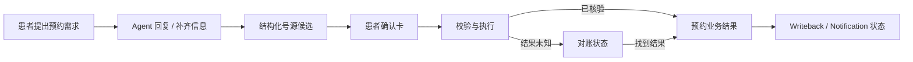

# Patient Ops Agent UI / UX 规格

> 状态：设计基线已实施（2026-08-15；2026-08-16 修订：初始空态的固定意图入口改为点击直接发送，与会话中段 `suggested_replies` 的“仅填入”规则区分；2026-08-17 修订：Operator 工作台新人可用性——个案处理进度步骤条、任务队列展示创建时间 / 等待时长并自动轮询、任务 ID 收入折叠技术详情、执行记录支持分类筛选与异常默认展开）  
> 范围：Channel Simulator、Operator View、按需展开的 Runtime / Trace。  
> 事实来源：[`SPEC.md`](../SPEC.md)、[`docs/architecture.md`](architecture.md)、[`contracts/agent-api.yaml`](../contracts/agent-api.yaml)。发生冲突时以 `SPEC.md` 为准。

## 1. Product UI Goal

Patient Ops Agent 的界面是企业级患者预约交付工作台，而不是通用聊天机器人或医疗营销站。它应让患者完成本人预约事务，也让演示者在一次操作中清楚验证以下事实：

- 患者提出的业务目标及当前可执行动作；
- Agent Run 所处的状态与工作流步骤；
- 高风险动作是否已经取得有效的 **Patient Confirmation**；
- 当前执行权归属 `AGENT` 还是 `OPERATOR`；
- 预约这一核心业务结果，和 Writeback / Notification 两类外围副作用是否分别成功；
- 失败后系统是在重试、对账（Reconciliation），还是已经转人工。

界面只展示服务端投影出的 `RunView`、Trace 与授权后的业务对象；不在客户端判定 Policy、状态迁移或业务成功，不展示 Token、完整 Patient ID、原始密码、未脱敏 Trace 输入输出或内部 Checkpoint。

### 1.1 用户与任务

| 角色 | 主要任务 | 关键界面结果 |
| --- | --- | --- |
| Patient | 创建、查询、取消自己的预约；选择候选；确认；取消当前流程；请求人工 | 明确下一步、可读的预约摘要、可信的最终结果 |
| Operator | 接管异常 Run，查看必要上下文与执行历史，处理或交还 Agent | 清楚看到执行权、Manual Task、受阻原因与处理责任 |
| Administrator / 运营负责人 | 判断预约服务是否健康、识别阻塞与风险，并在需要时诊断运行过程 | 首屏获得可行动的运营总览；按需展开 Run / Trace / Audit 证据 |

## 2. Design Principles

1. **业务优先，诊断按需。** 对话、候选、确认、最终结果和人工接管属于一级信息；Trace 与工程 ID 进入底部面板或详情抽屉。
2. **结构化动作不退化为聊天文本。** Slot、Appointment、Confirmation、Result、Handoff 均使用有明确字段和操作的业务组件。
3. **服务器是唯一事实来源。** 每个命令返回或轮询到新的 `RunView` 后才更新 UI；HTTP `2xx` 只表示命令接受，不等同于预约成功。
4. **状态有文字、颜色和位置三重表达。** Status Badge 不能只依赖颜色；等待与接管状态必须改变可交互区域。
5. **确认与审批语义严格分离。** Patient Confirmation 是患者对参数快照的确认；Operator Approval / Manual Task 不得伪装成患者确认。
6. **执行权可见且可阻断。** `execution_owner = OPERATOR` 时自动写操作停止，患者页显示接管横幅；这不是普通警告或 Toast。
7. **核心结果与副作用分开。** 已核验的 Appointment 成功，不因 Writeback 或 Notification 重试而被渲染成整体失败。
8. **渐进披露与隐私默认。** 脱敏 ID、Trace ID、Operation ID 仅在 Runtime Details 或 Trace Item 展开后出现，配复制按钮，不作为标题信息。

## 3. Information Architecture

### 3.1 页面 / 视图清单

| 视图 | 访问者 | 目的 | 一级内容 |
| --- | --- | --- | --- |
| 演示登录 | Patient / Operator / Admin | 使用 fixture-only 账号进入服务端签发的角色工作台 | 演示身份选择、密码、角色说明、登录错误 |
| 账号切换弹窗 | Patient / Operator / Admin | 在不暴露 Token 的前提下切换虚构演示身份 | 当前身份、演示身份选择、密码、切换影响说明、取消 / 确认 |
| 患者工作台 | Patient | 完成本人的预约任务 | 会话、业务组件、输入区、患者可读状态与结果 |
| Operator 个案工作台 | Operator | 领取并处理一个 Manual Task | 任务队列、脱敏 Run Context、处理说明、执行记录、交还 Agent |
| Admin 运营管理工作台 | Admin | 先判断整体服务运行情况，再按需诊断一次或多次 Run | 运营总览、待关注事项、图表、Run 诊断、Trace Timeline、Audit Feed |
| Manual Task 列表 | Operator | 找到待处理的人工接管 | 状态、原因、责任人、脱敏患者与意图摘要、创建时间与已等待时长（中性事实，不断言超时） |
| Operator Run Drawer | Operator | 在不脱离任务列表的情况下处理一个 Run | 接管上下文、Tool Execution、处理记录、交还 Agent |

登录后由服务端返回的 `actor_role` 决定入口。Patient 不暴露管理能力；Operator 不获得跨任务患者访问；Admin 不获得患者业务写操作。

### 3.2 按角色划分的桌面信息架构

界面按服务端签发的 `actor_role` 选择工作台；不得仅靠前端角色开关决定资源权限。顶部应用栏仅放产品名、当前角色 / 演示身份与连接摘要；不放 Token、完整 Patient ID 或装饰性欢迎语。当前演示身份必须是明确的 `button`，用于打开账号菜单，而不是不可交互文本。

- 账号菜单包含“切换演示身份”和“退出登录”。菜单可用 Enter / Space 打开、Escape 关闭并将焦点还给触发按钮；点击菜单外部也关闭。
- “切换演示身份”使用 modal dialog：打开后焦点落在身份选择；Escape / 取消关闭并返还焦点；提交时禁用重复操作。切换成功后重置当前 Conversation、Run、Trace 与本地草稿，再进入服务端签发角色对应的新工作台。
- 切换不取消、修改或延续原身份的预约 / Run；弹窗必须在提交前说明这一影响。密码输入每次均为空，账号目录不得含密码或 Token。

| 工作台 | 桌面结构（`>=1280px`） | 一级信息 | 明确省去的信息 |
| --- | --- | --- | --- |
| Patient | 可折叠会话导航 `200–220px` + 单列会话主区；单会话可收至 `56px` | 对话、候选、Confirmation、患者可读结果、Handoff、Composer | Runtime、Trace、Workflow Step、Execution Owner、Attempt、Writeback、技术 ID |
| Operator | `260–300px / minmax(560px,1fr) / 260–300px` | Manual Task 队列、任务关联会话、脱敏 Run Context、经授权 Trace、领取 / 回复 / 处理 / 交还操作 | 患者自然语言输入、患者示例提示、无任务关联的跨患者运行数据 |
| Admin | 默认单列运营总览，最大内容宽度 `1440px`；“运行诊断”使用 `260–300px / minmax(560px,1fr) / 280–320px` | 服务指标、待关注事项、漏斗、趋势、分布；按需进入只读 Run Detail、Trace 与 Audit | 患者业务写操作、完整 Patient ID、密码、Token、未脱敏输入输出 |

```text
Patient
┌────────────────────┬─────────────────────────────────────────────────────────┐
│ 会话（可折叠）       │ 患者会话：下一步 / 业务卡 / Handoff / Composer            │
└────────────────────┴─────────────────────────────────────────────────────────┘

Operator
┌────────────────┬──────────────────────────────────────────┬─────────────────┐
│ Manual Tasks   │ 个案处理：脱敏上下文 / 处理说明 / Trace   │ Task Context    │
└────────────────┴──────────────────────────────────────────┴─────────────────┘

Admin
┌────────────────────────────────────────────────────────────────────────────┐
│ 运营总览：关键指标 / 待关注事项 / 创建预约漏斗 / 趋势 / 状态与错误分布        │
├────────────────────────────────────────────────────────────────────────────┤
│ 运行诊断（按需）：Runs │ 只读 Run Detail / Trace Timeline │ Audit Feed       │
└────────────────────────────────────────────────────────────────────────────┘
```

- Patient 的状态只显示为可执行、患者可理解的业务文案，例如“请选择时段”“正在确认预约结果”“人工客服正在处理”；不得显示内部枚举或运行诊断。
- Patient 的 Message、结构化业务卡和 Composer 共享 `max-width: 960px` 内容轨。进入 Run 后 Composer 固定在对话区底部；初始态遵循 3.4 的紧凑任务启动面板。
- Operator 主区首先展示“患者说了什么”：仅显示当前 Manual Task 关联的患者消息、人工回复和最近系统回复，避免客服只看到抽象状态。未领取时可阅读上下文但不能发送，文案必须与此行为一致（“可先查看上下文；领取后才能回复患者或完成处理”）；领取后提供“向患者回复”输入框和独立的“发送给患者”操作。
- “发送给患者”只写入关联患者会话，不自动完成任务、交还 Agent 或触发预约写操作；应明确区分于“处理说明”和“交还 Agent”，并在操作区以说明文字强调“记录处理完成”仅登记处理结论、不通知患者。Operator 的“交还 Agent”必须常驻说明旧 Confirmation 将失效、服务端重新加载事实且不会自动恢复未授权写入。
- Operator 个案工作区在标题下方提供只读处理进度步骤条（领取任务 → 回复与处理 → 记录处理完成 → 交还 Agent），当前步骤高亮；它是 Manual Task 状态的纯展示映射，不引入客户端业务判断。任务摘要卡只展示会话区无法表达的信息（当前业务状态、执行归属、创建时间与已等待时长），不重复展示最近系统回复。
- Manual Task 队列由前端低频轮询自动刷新；新任务出现时以常驻文字提示与计数变化告知（`aria-live`，不使用 Toast），不抢占当前选中任务。任务 ID、Run ID 等技术标识在 Task Context 中默认折叠为“技术详情”并配复制按钮，不作为一级信息。
- Admin 默认显示由服务端返回的脱敏运营总览：关键指标、创建预约漏斗、按日趋势、状态 / 意图 / 错误分布和“现在需要关注什么”。运营总览不是客户端对 Audit 的猜测或 Mock；数据、统计口径和待关注类别均来自只读 `/api/v1/admin/dashboard`。
- “现在需要关注什么”只显示服务端确定性识别出的等待人工、未完成、后续服务待处理和安全策略拒绝。每一项说明当前数量、影响和建议下一步，并可进入关联 Run 的只读诊断；没有定义 SLA 或目标时不得显示“超时”“低于目标”等断言。
- Admin 的 Run、Trace 与 Audit 是诊断证据，位于“运行诊断”按需视图。事件、Workflow Step 与 Tool 名以中文业务说明为主，稳定内部代码仅在技术详情中披露；Trace 不挤压 Patient 的业务主线。

### 3.3 窄屏策略

MVP 优先桌面，但 `1024px` 以下不应横向溢出：Patient 左栏收起并保持单列会话；Operator / Admin 隐藏最右侧 Context / Audit，保留队列与主工作区。`< 768px` 队列改为横向可滚动选择器，主工作区单列展示。移动端不新增与桌面不同的业务路径或权限。

### 3.4 初始空会话的宽屏布局复核（2026-08-15）

复核依据：2048px 宽桌面下的“新的患者会话 / 尚未开始 Agent Run”初始态。患者工作台保留顶部身份与连接摘要，但不保留诊断右栏；需要调整的是超宽屏下的内容密度与操作锚点，而不是业务流程或状态语义。

| 观察到的问题 | 设计调整 | 验收标准 |
| --- | --- | --- |
| 初始 Agent 欢迎语之后出现大面积未被解释的空白，用户难以判断下一步。 | `ConversationFeed` 在尚未创建 Run 的初始态增加紧凑 `ConversationEmptyState`：说明仅可创建、查询或取消**本人**预约，并提供 2–3 个示例提示，文案预告各意图接下来的步骤数（创建预约需依次选择服务项目、日期、时段并确认；取消预约需先选择再二次确认；查询预约直接返回结果）。这些示例是固定、无歧义的顶层意图入口，点击即以该固定文案直接发起患者消息（等同于患者亲自输入并发送同一文案），仍走现有 `POST /messages` 流程，不绕过、不伪造 Run、候选、预约或其他业务对象，随即呈现服务端返回的下一步。这与会话中段由服务端下发的 `suggested_replies`（见 §5.1、§8.1，仅填入 Composer，需患者再主动发送）是两类不同交互，不共用同一条“仅填入不自动发送”的规则。查询提示必须是无需服务项目、日期或医生的完整只读请求，例如“查询我未来的预约”，不得被解析为创建预约。 | 首屏可在无需滚动的情况下看到欢迎语、空态引导和 Composer；点击示例提示会直接调用现有 `POST /messages` 发送流程并呈现服务端返回的结构化候选卡或只读结果，不需要再手动点击“发送”；发送查询示例后直接返回未来预约或空结果，不追问创建预约字段。 |
| 超宽中栏使底部 Composer 的输入区与发送按钮分散在两端，顶部边线显得像与内容脱节；初始态若强制撑满会在引导或输入框下方制造无意义的白色聊天画布。 | 使用 3.2 定义的共享内容轨：进入 Run 后 Composer 保持 sticky 底部操作面，输入框、发送按钮与消息卡在同一最大 960px 范围内排布；尚未创建 Run 时，Composer 紧跟空态示例，三栏容器随该任务启动面板的内容收束，以下回归应用画布。保留轻量边界，不使用浮动大阴影或营销式卡片。 | 2048px 宽下，Composer 内部宽度不超过 960px，左右边界与对话内容对齐；初始态首屏在示例、Composer 或 Composer 下方均不留下人为拉伸的白色聊天区域；1280px 及以下不出现无效横向留白或横向滚动。 |
| 患者没有运行诊断任务，却被 Runtime 面板持续打断。 | Patient 工作台移除 Runtime 与 Trace；将患者真正需要的状态放入会话标题、结构化业务卡或 HandoffBanner。Runtime、Trace 与 Audit 仅进入 Operator / Admin 对应工作台。 | Patient 首屏及任意预约流程不出现 Workflow Step、Execution Owner、Attempt、Writeback、技术 ID 或 Trace 入口。 |
| 单会话左栏的有效信息较少。 | 保持会话摘要与状态，但在单会话场景提供明确的折叠入口；折叠后仍可辨识当前会话和恢复导航。 | 默认展开时宽度不超过 220px；折叠至 56px 后不影响患者完成现有流程。 |

## 4. Visual Language and Tokens

整体风格为紧凑、中性、数据优先的 B2B SaaS：以文字层级、1px 边框、浅底色和有限状态色建立层次。避免渐变、玻璃拟态、重阴影、大圆角、大量彩色图标或营销页式留白。

### 4.1 基础 Token

实现时应映射到所选组件库的主题变量；业务组件禁止散落硬编码颜色。

| 类别 | Token | 建议值 / 用途 |
| --- | --- | --- |
| Spacing | `space-1`…`space-6` | `4 / 8 / 12 / 16 / 24 / 32px` |
| Radius | `radius-sm`, `radius-md` | `6px`, `8px`；确认卡与 Drawer 不超过 `8px` |
| Typography | `title`, `section`, `body`, `meta`, `mono` | `20–24 / 14–16 / 14 / 12–13px`；技术字段仅 `mono` |
| Surface | `bg-canvas`, `bg-surface`, `bg-subtle`, `border-default` | 页面底、面板、选中 / 提示底、普通边界 |
| Accent | `accent` / `accent-hover` | 唯一主操作、选中项、活跃导航 |
| Semantic | `success`, `warning`, `danger`, `info`, `neutral` | Badge、Inline Alert、结果图标；均带文本 |
| Focus | `focus-ring` | 键盘焦点 2px 高对比描边，不只改颜色 |

### 4.2 Status Badge 映射

Badge 始终显示中文标签，必要时保留英文枚举作为 Tooltip 或 Details 中的次级 Mono 文本。

| 领域 | 枚举 | 文案 | 语义 Token |
| --- | --- | --- | --- |
| Run | `ACTIVE` | 正在处理 | info |
| Run | `WAITING_PATIENT` | 等待您的操作 | warning |
| Run | `RECONCILING` | 正在确认预约结果 | info |
| Run | `WAITING_HUMAN` | 已转人工处理 | warning |
| Run | `COMPLETED` | 已完成 | success |
| Run | `COMPLETED_WITH_PENDING_SIDE_EFFECTS` | 预约已完成，部分后续处理中 | warning |
| Run | `FAILED` | 未完成 | danger |
| Run | `CANCELLED_BY_PATIENT` | 流程已取消 | neutral |
| Owner | `AGENT` | Agent 执行中 | info |
| Owner | `OPERATOR` | 人工客服已接管 | warning |
| Core | `NOT_STARTED` / `EXECUTING` | 尚未执行 / 正在执行 | neutral / info |
| Core | `OUTCOME_UNKNOWN` | 结果待确认 | warning |
| Core | `SUCCEEDED` / `FAILED` | 核心业务已成功 / 核心业务失败 | success / danger |
| Side effect | `NOT_REQUIRED` / `PENDING` | 无需执行 / 等待处理 | neutral / info |
| Side effect | `SUCCEEDED` | 已完成 | success |
| Side effect | `RETRY_SCHEDULED` | 等待重试 | warning |
| Side effect | `FAILED_NEEDS_HUMAN` | 需人工处理 | danger |
| Confirmation | `PENDING` / `CONFIRMED` | 待确认 / 已确认 | warning / info |
| Confirmation | `INVALIDATED` / `EXPIRED` / `CONSUMED` | 已失效 / 已过期 / 已用于本次操作 | neutral / danger / success |

## 5. Component Hierarchy

```text
AppShell
├── AppHeader
│   └── AccountMenu → AccountSwitchDialog
├── PatientWorkspace（PATIENT）
│   ├── RunNavigation（单会话可折叠）
│   └── ConversationHeader / Feed / Business Cards / Composer
├── OperatorWorkspace（OPERATOR）
│   ├── ManualTaskQueue（自动轮询 + 新任务提示）
│   ├── OperatorCaseWorkspace
│   │   ├── CaseProgressSteps（只读处理进度）
│   │   ├── AuthorizedRunContext
│   │   ├── ResolutionForm / ReturnToAgentConfirmation
│   │   └── TraceTimeline
│   └── TaskContextPanel（技术详情默认折叠 + 复制）
└── AdminWorkspace（ADMIN，只读）
    ├── AdminOverview（默认）
    │   ├── KpiCards / ActionItems
    │   ├── AppointmentFunnel / DailyTrend
    │   └── Status / Intent / Error Distributions
    └── RunDiagnostics（按需）
        ├── RunList
        ├── RunDetail / TraceTimeline
        └── AuditFeed
```

### 5.1 业务组件规则

| 组件 | 内容 | 交互与约束 |
| --- | --- | --- |
| `ConversationMessage` | Patient / Agent 文字、时间、发送状态 | 仅承载自然语言；不承载候选和确认的关键字段 |
| `BookingProgress` | 服务项目、可约日期、具体时段、确认预约四步及当前已选摘要 | 仅在创建预约 Run 中展示；已完成步骤显示真实服务端投影，后续步骤不可操作。患者用自然语言变更前置条件时，以最新 `RunView` 完整替换。 |
| `ServiceOptionList` | Clinic Core 返回的在售服务项目、名称和时长 | 仅在 `action_required = SERVICE_SELECTION` 显示；每项是“选择服务项目”按钮，提交稳定 `service_item_id + state_version`，不自动选择或创建预约。 |
| `AvailableDateList` | Clinic Core 真实可用 Slot 聚合出的日期和可约时段数 | 仅在 `action_required = DATE_SELECTION` 显示；每项是“查看当天时段”按钮，提交日期 + `state_version`。不展示无可用号源的日期，不在客户端计算可约数量。 |
| `SuggestedReplyBar` | 服务端 `RunView.suggested_replies` 下发的下一句建议 | 位于 Composer 输入框下方；点击只将 `message` 填入并聚焦输入框，绝不自动发送或触发业务命令；不得从 Agent 文案推断建议。Composer 禁用、Slot / Appointment 选择、确认或人工接管时隐藏。与初始空态的固定意图入口（§3.4，点击直接发送）是两类不同交互，不可互相套用规则。 |
| `SlotOptionList` | Clinic、Service Item、Doctor、日期、时间、可选状态 | 单选 `SlotOption`；选择后立即禁用其他选项并以最新 `RunView` 覆盖；提交 `slot_id + slot_version + state_version` |
| `AppointmentOptionList` | 待取消 Appointment 的必要摘要 | 同 Slot 选择；仅列出服务端返回且属于当前 Patient 的候选 |
| `ConfirmationCard` | 动作、Clinic、Service Item、Doctor、日期、时间、到期时间、状态 | 明显边框和“请确认以下预约 / 取消信息”标题；只回传服务器的 `confirmation_id` 与 `state_version`；不得让前端编辑受保护参数 |
| `BusinessResultCard` | Appointment 最终状态、预约摘要、结果说明 | 仅 `core_business_status = SUCCEEDED` 且核验完成后显示“预约已成功 / 预约已取消” |
| `SideEffectStatus` | Writeback、Notification 的独立状态 | 使用两行状态，不把 `RETRY_SCHEDULED` 覆盖成整体失败 |
| `RuntimeStatus` | Run Status、Workflow Step、Intent、Attempts | 人类文案优先；Workflow Step 作为解释用次级信息，不把技术 ID 做视觉标题 |
| `ManualTaskQueue` | 任务状态、原因、责任人、脱敏患者与意图摘要、创建时间与已等待时长 | 每项是选择任务的按钮；已等待时长是中性事实，不显示“超时”等 SLA 断言；队列自动轮询刷新 |
| `CaseProgressSteps` | 领取任务 → 回复与处理 → 记录处理完成 → 交还 Agent | 只读步骤条；`CANCELLED` 显示取消说明；当前步骤使用 `aria-current="step"` |
| `TraceTimeline` | 有序 Trace Event、时间、节点、Tool、结果、耗时 | 默认摘要；原始样式的详情只在展开时显示，且必须脱敏；人工接管、策略拒绝与结果未知事件默认展开一层 |
| `HandoffBanner` | 接管事实、原因、Manual Task 状态、当前所有者 | 常驻在对话标题下方；说明 Agent 已暂停自动执行，但不替代 Composer；不是可关闭 Toast |
| `AccountMenu` | 当前演示身份、切换身份、退出登录 | 仅展示服务端返回的非敏感名称和角色；关闭时将焦点归还触发按钮 |
| `AccountSwitchDialog` | 演示身份、密码、切换影响、错误状态 | 提交前说明原 Run 不被取消；切换成功后清空浏览器内存会话，不显示或存储 Token |

## 6. Core User Flows

### 6.1 创建预约



1. 患者发送创建预约消息。消息进入对话流，同时在 Runtime 创建或更新 Run；发送按钮呈 Loading，避免重复提交。
2. 缺少服务项目时，Agent 说明“请选择服务项目”，并在消息后显示 `ServiceOptionList`；服务项目来自服务端投影的 Clinic Core，点击只更新 Run 条件。缺少日期时，显示 `AvailableDateList`，只包含该服务项目真实可约的日期和时段数。若所选服务项目未来 7 天内没有任何可约日期，服务端会清空该选择并重新回到“请选择服务项目”，重新提供完整服务项目候选，而不是停留在没有任何候选、按钮或建议可用的死态；文案说明具体是哪个服务项目暂无号源。
3. 服务项目、日期和时段均采用对话内步骤卡，并由 `BookingProgress` 标明当前步骤；这不是脱离会话的多页表单。Composer 始终保留为变更偏好和自由表达的入口。
4. 选择日期后，服务端返回 `action_required = SLOT_SELECTION`，在 Agent 消息后渲染 `SlotOptionList`，而非让患者从文本中复制时间。每项必须显示实际日期、时间、诊所、服务和医生。
5. 精确条件没有号源时，Agent 文案必须指出原日期/时段。服务端可在 `RunView.suggested_replies` 提供“查看未来 7 天可约时段”等受控建议，前端将其置于 Composer 下方；点击仅填入“有哪些日期可约”并聚焦，患者仍须主动发送。前端不得从文案自行推测建议、日期或号源。患者明确追问后，服务端返回替代候选并清空旧建议。
6. 选择候选后，以服务器生成的 `ConfirmationCard` 替换选择区。卡片明确说明确认后会提交预约；按钮为“确认预约”。
7. 确认命令被接受后，按钮进入不可重复的“正在提交”状态；主区域显示“正在核验预约结果”，直到 `RunView` 的核心业务状态已确定。
8. 只有 `core_business_status = SUCCEEDED` 才展示成功结果；随后以独立状态展示运营回写和患者通知。

### 6.2 查询与取消预约

- 查询预约是只读流程：返回“您的预约详情”卡或明确的空结果“暂无未来预约”，不出现确认卡或“预约已成功”业务结果。详情卡逐项展示预约状态、开始时间、诊所、服务项目和医生；使用 Clinic Core 预约展示 DTO 返回的 `clinic_name`、`service_item_name`、`doctor_name`，例如“合成徐汇门诊”“洗牙”“张医生”。上游展示名缺失时才回退显示稳定 ID；浏览器不得自建业务对象字典或臆造名称。
- 取消预约先显示“请选择要取消的预约”列表，即使只有一条。每条展示 Clinic、Service Item、Doctor、日期、时间和状态，并提供醒目的危险样式“取消此预约”按钮；点击该按钮只选择服务端候选，不执行取消。
- 选择后才渲染取消确认卡。取消确认卡使用“确认取消预约”而非泛化“确认执行”，完整显示 Clinic、Service Item、Doctor、日期、时间，并以“确认取消预约”作为唯一高风险主操作；患者可通过现有“取消当前流程”安全退出而不改变预约。
- “取消当前流程”只在非终态、核心写操作前可用；须有二次确认文案“这不会取消已成功的预约”。它调用取消当前 Run，不能调用取消预约。

### 6.3 人工接管与交还

1. 患者请求人工或系统发生接管条件时，收到 `WAITING_HUMAN + execution_owner = OPERATOR`。
2. 患者工作台立即显示常驻 `HandoffBanner`：“当前已由人工客服接管”。保留已发生对话、候选和结果以提供上下文。
3. 自动写操作、候选选择、Confirmation 主按钮和“取消当前流程”等 Agent 动作均禁用；Composer 保持可用，提示“补充信息给人工客服”。患者发送的消息进入同一会话和 Manual Task，不能绕过执行权触发 Agent 理解、Workflow 推进或写操作。
4. Operator 的任务列表显示该 Manual Task。进入工作区后可先查看任务关联的患者消息、脱敏患者上下文、Run 摘要、Trace、Tool Execution、当前原因和处理记录；不得展示不关联该任务的会话内容。
5. Operator 领取任务后可发送人工回复。回复只进入关联患者会话，不等同于任务完成、患者确认或 Agent 恢复；随后可在后端允许的 API 语义内记录处理结果。选择“交还 Agent”时须明确提示：旧 Confirmation 已失效，Agent 会重新加载服务端事实，后续高风险操作需重新确认。

## 7. Page States Matrix

| State | 触发 / 服务端依据 | 主区行为 | Runtime / 操作 |
| --- | --- | --- | --- |
| Loading | 首次加载、命令进行中、轮询刷新 | Conversation / Runtime 使用与布局一致的 Skeleton；不显示假数据 | 禁用重复提交；保留上次已确认内容 |
| Empty | 尚无会话或查询结果为空 | 初始态在对话内容轨中说明可创建、查询、取消本人预约；提供 2–3 个固定文案的示例提示并预告后续步骤数，点击即直接发送对应消息（仍走真实 `POST /messages`，不伪造业务对象） | Runtime 紧凑置顶显示“尚未开始 Agent Run”，不编造进度或状态 |
| Active | `run_status = ACTIVE` | 正常消息与结构化业务步骤 | 显示“正在处理”、当前步骤；Composer 按 `action_required` 决定可用性 |
| Waiting Patient | `WAITING_PATIENT` | 高亮唯一待办：补充信息、选择候选或确认 | 显示“等待您的操作”；不自动推进 |
| Retrying | 重试中的 Attempt，未进入对账 | 不把失败消息当最终结果；显示“正在按原操作重试（第 n / 3 次）” | Attempts 与最后一次错误摘要可见；不允许重复确认 |
| Reconciling | `run_status = RECONCILING` 或 `core_business_status = OUTCOME_UNKNOWN` | 显示“正在确认预约结果”，并展示已发生的超时，不宣称成功或失败 | Trace 入口显示对账步骤；禁止创建新的同类操作 |
| Waiting Human | `WAITING_HUMAN` 或 Owner 为 `OPERATOR` | 常驻接管横幅、自动写入/选择/确认控制锁定；Composer 仍可发送补充信息 | 显示 Owner、Manual Task、接管原因；Operator View 显示任务状态与新消息 |
| Success | `COMPLETED` 且核心 / 副作用已完成 | 结构化业务结果卡 | Core、Writeback、Notification 均为明确终态 |
| Partial Success | `COMPLETED_WITH_PENDING_SIDE_EFFECTS` | 先显示“预约已成功”，再显示“后续处理等待重试” | 核心成功为 success；各 Side Effect 独立 warning / danger |
| Failed | `FAILED`，且无核心成功 | Inline Error 说明下一安全动作（重新查询、重新认证或转人工） | 展示错误类别与可恢复动作，不展示“重试”给不可重试错误 |
| Forbidden | `FORBIDDEN` | 不透露他人资源是否存在；说明无权执行该操作 | 禁用该动作，提供回到本人预约或请求人工的安全入口 |
| State conflict | `STATE_VERSION_CONFLICT` | 显示“信息已更新，请刷新后继续”；保留本地草稿 | 获取最新 `RunView` 后重新渲染，禁止旧表单继续提交 |

## 8. Interaction and Data Rules

### 8.1 命令、轮询与并发

- 所有写命令携带当前服务端的 `state_version` 和唯一 `X-Request-ID`；界面不得以缓存 State 覆盖新返回的 Run。
- 确认只提交 `confirmation_id`，号源选择只提交 `slot_id + slot_version`；前端绝不拼装或修改 Clinic、Doctor、Service Item 等受保护参数。
- Command 受理后以返回的 `RunView` 立刻更新；若 Run 仍是 `ACTIVE`、`RECONCILING` 或副作用待处理，再短轮询 `GET /runs/{run_id}`，在终态或等待用户 / 人工时停止轮询。
- `suggested_replies` 是服务端按当前 Run 状态授权的纯输入辅助，不是业务操作。客户端只识别 `FILL_COMPOSER`：填入 `message`、聚焦 Composer，等待患者主动发送；不得自动提交、不得从 `current_reply` 解析或自行生成建议。人工接管时隐藏旧建议。收到后续 RunView 后以其数组完整替换旧建议。
- 同一动作请求未完成时禁用该组件的其他主操作；网络中断可重试原 Command，但不可在客户端生成新的业务 Operation。
- 收到更新的 `state_version`、候选版本变化或 Confirmation `INVALIDATED / EXPIRED` 后，旧卡片变为只读历史记录，并由最新服务端状态决定下一步。

### 8.2 操作可用性

| 条件 | UI 行为 |
| --- | --- |
| `action_required = SERVICE_SELECTION` 且 Owner 为 `AGENT` | 显示真实服务项目列表；启用“选择服务项目” |
| `action_required = DATE_SELECTION` 且 Owner 为 `AGENT` | 显示真实可约日期及时段数；启用“查看当天时段” |
| `action_required = SLOT_SELECTION` 且 Owner 为 `AGENT` | 启用 Slot 单选与“选择此时段” |
| `action_required = APPOINTMENT_SELECTION` 且 Owner 为 `AGENT` | 启用每条 Appointment 的“取消此预约”；选择后进入取消确认卡 |
| `action_required = CONFIRMATION` 且 Owner 为 `AGENT` | 启用对应的确认按钮；显示到期时间 |
| `action_required = HUMAN` 或 Owner 为 `OPERATOR` | 锁定自动写操作；显示接管状态 |
| 任何非终态、核心写前 | 显示“取消当前流程”；已进入执行 / 对账时隐藏或禁用并解释原因 |
| `COMPLETED`、`FAILED`、`CANCELLED_BY_PATIENT` | 当前 Run 只读；患者可发起新消息形成新 Run |

### 8.3 错误文案规则

错误文案采用“发生了什么 + 当前安全状态 + 下一步”的形式，避免暴露内部实现。

| 场景 | 推荐患者文案 |
| --- | --- |
| `SLOT_OCCUPIED` / `SLOT_VERSION_CONFLICT` | “这个时段刚刚发生变化，原确认已失效。请从更新后的可选时段中重新选择。” |
| `TIMEOUT` / `UNKNOWN` | “我们正在确认预约结果，请勿重复提交。确认完成后会在这里更新。” |
| `UNAUTHENTICATED` | “登录状态已失效，请重新登录后继续。” |
| `FORBIDDEN` | “你无权处理该预约。为保护隐私，我们无法展示更多信息。” |
| 连续重试耗尽 | “自动处理未能安全完成，已转交人工客服处理。” |
| Notification 重试 | “预约已成功。通知发送正在重试，不影响本次预约。” |

## 9. Runtime and Trace UX

### 9.1 Runtime Panel

Runtime 是固定的业务运行上下文，不是调试 JSON。默认按以下顺序展示：

1. `Run Status` 与人类可读说明；
2. `Execution Owner`，人工接管时置顶；
3. Intent、Workflow Step、待办动作；
4. Selected Slot 或目标 Appointment 的摘要；
5. Confirmation Status 与剩余有效时间；
6. Core Business Status；
7. Writeback / Notification Side Effect Status；
8. Attempt Count、最后错误摘要；
9. 折叠的“技术详情”：脱敏 Patient ID、Run ID、Operation ID、Manual Task ID、Trace ID 和复制按钮。

`Appointment Status` 只能在业务结果摘要中表达；不得作为 `Run Status` 或 Core Business Status 的替代品。`operation_id` 为空不是错误，在只读查询 Run 中不展示占位符。

### 9.2 Trace Bottom Panel

Trace 采用纵向时间线。每项按类型呈现最小可用信息：

| Trace 类型 | 默认展示 | 展开内容 |
| --- | --- | --- |
| User / Agent | 事件、时间、工作流节点 | 脱敏后的结构化理解摘要 |
| Workflow | 节点、状态、耗时 | 前后状态差异（仅允许字段） |
| Policy | Allow / Deny、Reason Code | 被校验的非敏感条件摘要 |
| Tool Attempt | Tool、Attempt、结果、耗时 | Masked Input / Output、错误码、Correlation ID |
| State Transition | 事件、前后步骤、Run Status | 服务端投影的安全字段差异 |
| Reconciliation | Operation 结果、当前轮次 | UNKNOWN → 查询 → Found / Not executed 的链路 |
| Side Effect | Writeback / Notification 状态 | Outbox 尝试次数、下一次重试时间（若可用） |

默认筛选为“全部”；提供 `Workflow`、`Policy`、`Tool`、`Recovery`、`Side effect` 分类。错误、对账和人工接管项默认展开一层摘要，但不渲染 Raw JSON 大段文本。原始详情必须来自已脱敏的服务端字段，UI 不承担脱敏责任。

## 10. Permission and HITL UX

### 10.1 Patient Confirmation

- Confirmation Card 视觉上不同于普通消息：有明确标题、受保护参数表格、到期提示、风险说明与唯一主操作。
- 创建与取消使用不同标题和动词；按钮例如“确认预约”“确认取消预约”，不使用含混的“继续”。
- 点击确认后先显示“正在校验并提交”，而非乐观显示成功。确认被消费后卡片变成只读“此确认已用于本次操作”。
- 参数被修改、Slot 版本变化、过期或接管时，原卡片显示对应失效理由；任何重新开始都必须获得新的服务端 Confirmation。

### 10.2 Human Handoff

当 Owner 是 `OPERATOR`：

- 患者工作台标题下持续显示“当前已由人工客服接管”；包含接管原因与 Manual Task 状态，但不强迫展示工程 ID。
- Agent 自动执行以“已暂停”展示；高风险操作的确认、候选选择和取消流程不可继续使用，但 Composer 保持可用，患者可以向人工客服补充信息。
- Operator View 的标题、任务行和 Drawer 共同显示 Owner 与任务状态，避免“任务已创建但谁负责”不清楚。
- “交还 Agent”是有后果的操作：弹出确认说明旧 Confirmation 失效、服务端将重新加载事实、不会自动恢复未授权写入。交还成功前不乐观切换 Owner。

### 10.3 权限不足

`UNAUTHENTICATED`、`FORBIDDEN` 与 `POLICY_REQUIRES_HUMAN` 使用不同文案和可用操作。前两者不能通过展示更多患者数据来解释；后一者可展示“已转人工”的流程状态。任何禁用控制都应有可聚焦说明或 Tooltip，不可只把按钮变灰。

## 11. Failure and Recovery UX

### 11.1 Reconciliation

当外部写操作 `outcome = UNKNOWN`，页面必须避免“预约失败”与“预约成功”两种结论。主区使用 In-progress Result Card：

```text
正在确认预约结果
创建预约请求未收到明确结果，系统正在根据本次操作记录确认实际状态。
当前阶段：请求超时 → 查询操作结果 → 等待确认
请勿重复提交。
```

Trace 中可见同一 Operation 的对账链路。若找到结果，卡片平滑更新为已核验的业务结果；若达到阈值并接管，替换为 HandoffBanner，不能提供“再创建一次预约”的按钮。

### 11.2 Retry

- 对 `RATE_LIMITED` 与 `UPSTREAM_UNAVAILABLE` 等明确 `NOT_EXECUTED` 的可重试错误，展示当前第几次尝试和退避等待；不能让患者重复点确认。
- `SLOT_OCCUPIED` / `SLOT_VERSION_CONFLICT` 不显示自动重试。旧确认无效后返回新的候选选择，要求重新确认。
- 失败信息放在相关业务卡片附近，同时写入 Trace；Toast 只能作为补充，不能是唯一载体。

### 11.3 Partial Success

当 `Appointment = CONFIRMED` 但 `Notification = RETRY_SCHEDULED`：

```text
✓ 预约已成功
  [预约摘要]

⚠ 后续处理
  运营回写：已完成
  患者通知：等待重试（不影响预约）
```

核心成功使用 success 语义；外围失败或重试只影响其所在行。不得将 Run 标成泛化“失败”，也不得建议患者重复预约。

## 12. Accessibility and Content Requirements

- 使用语义化 `main`、`nav`、`aside`、`section`、`button`、`form`、`label`、`table` / `list`；状态更新通过合适的 `aria-live` 区域播报，不对高频轮询重复播报。
- 所有选择、确认、取消、展开 Trace、打开 Drawer 与任务表格可通过键盘操作，焦点顺序与视觉顺序一致，Drawer 打开后焦点被管理并可用 Escape 关闭（Handoff 常驻横幅除外）。
- Icon 必须有文字或可访问名称；状态永远同时有 Badge 文本、图标 / 形状和颜色。
- Loading、disabled、error、expired、invalidated 均要具有明确文本。禁用的原因通过关联说明提供给键盘和读屏用户。
- 意外的前端渲染错误不得留下空白页面：显示可理解的恢复页和“刷新页面”操作；恢复提示不得声称当前预约已提交、取消或失败。
- 对比度遵循 WCAG AA 的可读性目标；不依赖红绿组合区分成功和失败。
- 患者标识默认脱敏（例如 `P***001`）；不向 DOM、复制板、日志或 Trace 暴露 Token、密码、完整敏感资料。

## 13. Implementation Boundary and Acceptance Criteria

### 13.1 当前实现审计

当前实现采用独立的 `web/` React / Vite 工程。开发时 Vite 将 `/api` 代理到本地 FastAPI；Docker 环境由独立 Nginx 容器托管构建产物并代理到 `agent-api`。因此浏览器以同源路径访问 API，不需要为此演示页放宽 Agent API 的 CORS 策略。

FastAPI 不再持有内嵌 HTML 或 UI 状态，仅提供 API、鉴权和业务运行时。前端保持 Token 仅在内存中，不展示或持久化 Token、密码或完整 Patient ID。登录响应由服务端返回 `actor_role`，前端据此选择 Patient、Operator 或 Admin 工作台；每个 API 仍由服务端再次验证角色与资源范围。前端不新增业务决策或 Policy。

### 13.2 前端实现验收

- [x] Patient、Operator、Admin 分别提供匹配其任务的页面结构；患者端不出现 Runtime / Trace，Admin 默认进入基于服务端真实聚合数据的运营总览，Operator 与 Admin 仅展示经授权的诊断信息。
- [x] Slot、Appointment、Confirmation、Business Result、Side Effect、Handoff 有独立的结构化组件。
- [x] 任意高风险写操作只可由服务器下发的 `confirmation_id` 与当前 `state_version` 提交。
- [x] `WAITING_HUMAN / OPERATOR` 清楚显示执行权已转移，并阻断 Agent 自动写操作。
- [x] `RECONCILING` 不宣称业务成功或失败；显示对账过程且不重复创建业务 Operation。
- [x] `COMPLETED_WITH_PENDING_SIDE_EFFECTS` 分开表达核心预约成功和外围副作用重试。
- [ ] Loading、Empty、Waiting Patient、Retrying、Reconciling、Waiting Human、Partial Success、Failed、Forbidden、State Conflict 都有指定 UI 行为。
- [ ] Runtime 与 Trace 中的 Patient ID、Run ID、Operation ID 均为次级、按需披露的信息；Patient ID 脱敏。
- [ ] 界面满足本文件第 12 节的基本可访问性要求。

已验证：生产构建通过；基于真实 FastAPI API 的 Playwright 覆盖患者预约、人工接管、Operator 领取/处理/交还、Admin 只读观测、账号切换、宽屏与窄屏无水平溢出及基础键盘聚焦。完整 WCAG 审计仍保留为后续验收项。

### 13.3 当前 Contract Gap

以下缺口由现有 API / `RunView` Contract 决定，前端不得以客户端状态或假数据绕过：

| 缺口 | 前端当前行为 | 需要的后端契约（未来工作） |
| --- | --- | --- |
| Confirmation 状态与过期时间 | Confirmation Card 仅在 `action_required = CONFIRMATION` 时展示；Runtime 不推断 `CONFIRMED / CONSUMED / EXPIRED` | 在安全的 `RunView` 中提供 Confirmation 的状态、过期时间和经服务端处理后的展示摘要 |
| 会话记录上线前创建的 Manual Task | 显示“尚无可展示的患者消息”，不会从 Trace、Run 摘要或模型推断中补造患者原文 | 历史迁移需有经授权的原始渠道记录来源、保留期限和脱敏规则；MVP 不回填历史内容 |

## 14. Deferred Decisions

- 真实生产身份源、组织/队列范围与管理员的完整策略配置权限不在 fixture-only 演示范围；当前角色 Token 仅用于演示端到端的最小权限边界。
- Trace 的保留期限、可下载性与管理员筛选维度属于可观测性治理，不在 MVP 患者页面承诺。
- 实时推送（SSE / WebSocket）尚无现有 API Contract；MVP 可用受控轮询获取 `RunView`，未来新增推送前需单独定义断线恢复、事件幂等与权限契约。
